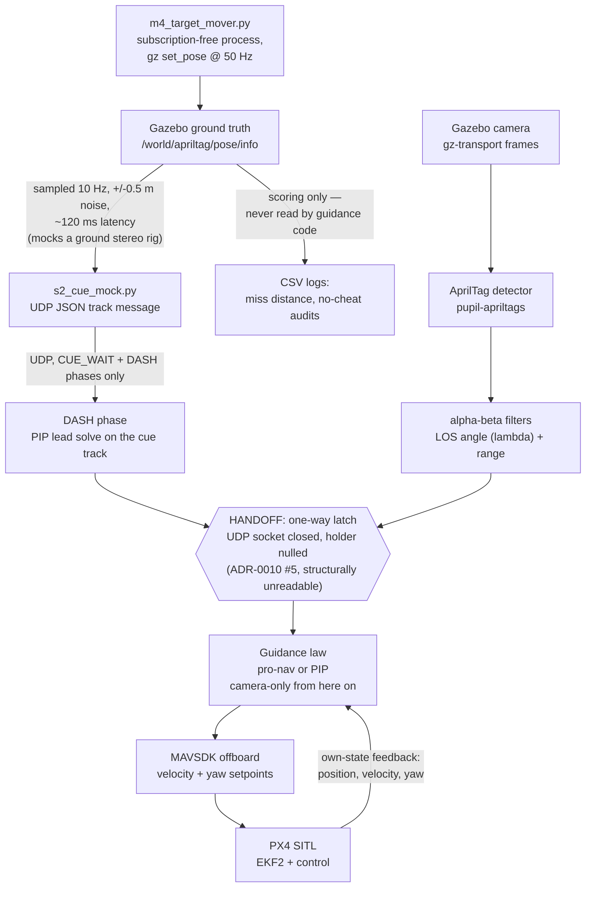

<!-- DRAFT pending M5 Monte-Carlo; structure final -->

# Counter-UAS Interceptor Sim: Camera-Only Proportional Navigation in PX4/Gazebo

A **simulation-only** counter-UAS interceptor: a quadcopter that uses its own
forward monocular camera to visually detect an AprilTag riding on a target
drone, then autonomously intercepts it — first a stationary target, then a
moving one — using **proportional navigation**, the missile-guidance law that
commands acceleration proportional to how fast the line of sight to the
target is rotating. It runs headless in **PX4 SITL + Gazebo Harmonic** (the
`gz_x500_mono_cam` airframe), flown over **MAVSDK-Python**, with every run
logged to CSV so every number below traces to a file you can re-open. This is
a portfolio project for aerospace internship applications: the target resume
line it exists to make true and defensible is

> *"Implemented proportional-navigation guidance for autonomous visual
> intercept in PX4/Gazebo SITL; validated via Monte-Carlo miss-distance
> analysis."* — [`GOALS.md`](GOALS.md)

Full mission, scope, and the "what this is / is not" boundary live in
[`GOALS.md`](GOALS.md). Milestone-by-milestone status is in
[`PROGRESS.md`](PROGRESS.md); the current working front is
[`NEXT.md`](NEXT.md); every non-trivial decision (with its reasoning, and
where a council of independent reviewers weighed in) is logged in
[`docs/decisions.md`](docs/decisions.md).

**Read the honesty section below before the results table.** The AprilTag is
a stand-in, not a real-world sensor, and this README says exactly what that
does and doesn't mean for the numbers that follow.

---

## Headline results (traced to a gate, an ADR, or a log)

| Milestone / experiment | Result | Bar | Source |
|---|---|---|---|
| **M3** — static intercept, hold 2 m standoff | final standoff error **0.018 m** / **0.035 m** (two verifier-confirmed runs) | < 0.5 m | `scripts/check_m3.sh`; ADR-0008; `logs/m3_intercept_20260705T000619Z.csv`, `...000818Z.csv` |
| **M4** — pro-nav vs. pursuit, 2.0 m/s crossing target, camera-only | pro-nav miss **0.402 / 0.277 / 0.443 m** vs. pursuit **2.544 / 2.109 / 2.048 m** (3 independent gate runs, identical paths) — pro-nav 4.6-7.6x tighter | pro-nav < 1.0 m | `scripts/check_m4.sh`; ADR-0009 + 2nd addendum; `logs/m4_intercept_{pursuit,pronav}_20260705T{0322,0324,0331}xxZ.csv` |
| **S2** — two-stage handoff, 6 m/s crosser (uncatchable from a hover start, ADR-0011 addendum) | miss **1.1-2.3 m** across dev/gate/verifier flights (gate runs: pip 2.291 m & 2.270 m, pronav 1.992 m & 2.342 m), both laws pass, handoff latches, all honesty audits pass | tiered < 2.5 m (this gate proves the *architecture* — a running start + honest handoff — not sub-meter precision at 3x M4's speed) | `scripts/check_s2.sh`; ADR-0010 #7, ADR-0013; `logs/m4_intercept_{pip,pronav}_20260705T21*Z.csv` |
| Ground-link A/B: cue **emits** filtered velocity vs. drone **differentiates** noisy position, Gazebo, 6 m/s, paired n=8 | EMIT mean **1.394 m** / Pk\@2 **75%** vs. DIFF mean **1.808 m** / Pk\@2 **50%** — DIFF worse on 6/8 paired seeds, direction confirms the lab's #1 lever, but the delta (+0.41 m) is **not yet statistically significant at n=8** | — (design finding, not a gate) | ADR-0015 2nd addendum; `logs/mc_realistic_EMIT_20260706T015033Z.csv`, `logs/mc_realistic_DIFF_20260706T022749Z.csv` |
| Preliminary Pk-vs-radius batch, pronav, 6 m/s, N=20 (**pre-realism-upgrade — superseded by M5**) | mean miss 2.189 m; Pk(R=1.0 m) 5% [95% CI 0.9-24%]; Pk(R=2.0 m) 35%; Pk(R=2.5 m) 70%; Pk(R=3.0 m) 95% [76-99%]. Every flight lost the tag for >1 s right at closest approach — but see the root-cause note below: that dropout is a *symptom*, not the cause. | — | ADR-0014 addendum; `logs/mc_batch_20260705T225008Z.csv` |
| **Root-cause diagnosis** — why fast-crosser flights miss ~1.4 m (41-flight forensics) | The miss is **kinematic, not perceptual**: 96% determined at handoff (r²=0.99 between zero-effort-miss@handoff and final miss); the terminal window (~0.4 s) is physically too short to fix the delivered geometry (½·a·t_go² = 0.72 m « 1.69 m). A *perfect* terminal camera cuts miss only 25%. Fix = acquire earlier + better handoff geometry, **not** a better seeker. | — (corrects the earlier "perception-limited" reading) | **ADR-0023**; `docs/terminal_diagnosis.md` |
| **M5** — final Monte-Carlo Pk-vs-radius curves, all speeds/paths, proximity metric | <!-- TODO: M5 Monte-Carlo final numbers under the ratified proximity-radius metric (ADR-0025): headline ram R≈0.5 m + net R≈1.5 m --> | plots + README complete | pending |

Preliminary plots from that pre-realism batch (kept for the writeup, **not**
the final M5 numbers):


Foundational milestones M0 (toolchain boot), M1 (camera pipeline), M2
(AprilTag detection, 1.000 detection rate / 0.0861 m mean pose error) all
passed their gates on 2026-07-04 — see [`PROGRESS.md`](PROGRESS.md) for the
full roll-up.

---

## Architecture

Two sensors, one interceptor. A mocked ground cue steers the *mid-course*
dash; the onboard camera takes over completely for the *terminal* phase, with
no way back to the ground link once it does.



<details>
<summary>Plain-text fallback (if Mermaid doesn't render)</summary>

```
 GROUND (mocked stereo rig, ADR-0010 #4)             INTERCEPTOR (onboard)
 -----------------------------------------          -------------------------
 Gazebo ground truth pose                            Gazebo camera frames
        |                                                    |
        | sampled 10 Hz, +/-0.5 m noise,             AprilTag detector (pupil-apriltags)
        | ~120 ms latency                                    |
        v                                             alpha-beta filters (LOS lambda, range)
 s2_cue_mock.py --UDP JSON--> DASH phase                      |
   (PIP lead solve on cue track)                              |
        \                                                     |
         \-------------------> HANDOFF: one-way latch <-------/
                                (UDP closed, holder nulled,
                                 ADR-0010 #5 -- structurally
                                 unreadable after this point)
                                          |
                                 Guidance law: pro-nav or PIP
                                 (camera-only from here on)
                                          |
                                 MAVSDK offboard velocity + yaw
                                          |
                                 PX4 SITL (EKF2 + control) ---> own-state feedback loop

 Ground truth pose ALSO streams straight to CSV logs (miss distance, no-cheat
 audits) -- scoring only, never read by any guidance code. Target motion
 comes from m4_target_mover.py, a separate subscription-free process
 streaming gz set_pose at 50 Hz (a gz-transport quirk: a process holding ANY
 topic subscription never receives service responses -- ADR-0009).
```

</details>

The honesty boundary that makes this diagram trustworthy: the AprilTag
detector and filter chain never touch the ground-truth pose topic — only
rendered camera pixels. The mocked ground cue *is* allowed to read (a
degraded version of) ground truth, because it stands in for a real,
independent sensor (a ground stereo rig) that GOALS.md explicitly scopes out
of this sim. Every gate script re-derives the numeric no-cheat check: commands
must trace to the camera's measured range/bearing, not to the scoring feed.
`tests/test_honesty_static.py` backs this with a fast, sim-free static check
of the guidance source itself (no ground-truth or post-latch cue read ever
feeds a command), runnable standalone or under pytest.

---

## Honesty: what this sim proves, and what it doesn't

**The AprilTag is a stand-in for "a reliable target lock exists," not a claim
that real hostile drones carry fiducials.** A real FPV threat has no tag on
it. Read this section before trusting any number above.

### What transfers to the real system

The piece that generalizes is the **guidance loop**: bearing (and its rate of
change, the line-of-sight rate lambda-dot) goes in, a lateral acceleration
command comes out, proportional navigation and MAVSDK/PX4 do the rest. That
loop is **agnostic to how the bearing was produced.** Proportional navigation
only ever needs an *angle rate* — it does not care whether that angle came
from a fiducial, a neural-net bounding box, or anything else. That's the
structural reason the whole two-sensor split (ground cue mid-course, onboard
camera terminal) works at all: swap the bearing source and the guidance math
is unchanged. The guidance arc below (pursuit -> pro-nav -> two-stage handoff)
is the part of this project that ports to a real interceptor close to as-is.

### What does not transfer

- **The perception problem itself.** A real terminal seeker has to *find* a
  small, fast, non-cooperative drone against sky clutter, then hold that lock
  through motion blur and vibration — a much harder problem than fiducial
  detection. That system is designed, not simulated, in
  [`docs/perception_design.md`](docs/perception_design.md) and ADR-0015 (real
  ML on a Hailo NPU, detect-then-track, not the AprilTag detector).
- **EO-only, day-only limits.** The designed ground rig and onboard camera are
  electro-optical and daylight-only in the proof-rig stage; night/all-weather
  needs thermal, staged and disclosed as a later capability, never folded
  silently into a headline number (ADR-0015).
- **Every sim-only physics simplification**: no motion blur, no rolling
  shutter, no airframe vibration, no variable outdoor lighting (the world's
  sun angle needed an emissive-texture hack just to keep the tag legible in
  sim, ADR-0007). Real detection cadence will be worse than what these logs
  show, not better.
- **The target board holds a fixed orientation (facing world −X) and only
  translates** — the mover sets position, never attitude (ADR-0010 #6). A real
  hostile drone is not a flat, fixed-orientation fiducial, so a direction-
  dependent detection-timing effect is a sim artifact, not a guidance property:
  left-to-right vs right-to-left crossings present mirror-opposite tag aspect
  angles, so the interceptor first detects the tag ~12 m out on one and ~8 m on
  the other, producing a real but modest ~0.2–0.44 m miss asymmetry. The
  guidance itself is proven direction-symmetric (the pro-nav gain fits to
  exactly 5.000 with r²=1.000 in *both* directions — it is not a sign bug;
  ADR-0024 addendum, audit ADR-0026 item B).

### The camera FOV was narrowed partway through (disclosed, re-baselined)

The camera's field of view was changed from 99.7° to **60°** (ADR-0024
addendum, the Tier-2 acquisition-range work). This is a hardware-analog change
— a longer/narrower acquisition lens, the exact tradeoff a real seeker design
makes — **not** an inflation of the target's apparent size (that boundary is
ADR-0010): the tag's physical dimensions are unchanged. It reopens and re-earns
the affected gates rather than assuming them: M1 is unaffected (same resolution
and rate); M2's accuracy gate was re-run and re-passed (pose error actually
*improved*, 0.086 m → 0.026 m, from more pixels on target); and M2's detection
*envelope* was **measured, not assumed** — reliable to ~14 m with the 60° lens
(`scripts/check_m2_envelope.py`), versus the old ad-hoc ~6 m figure. All
Monte-Carlo / Pk numbers dated before this change used the wide-FOV camera;
numbers after use the narrow one — the commit boundary is in `docs/decisions.md`.

### The lethal radius is a narrative assumption, not a modeled collision

There is no collision volume in this sim — the target is a flat board with no
airframe body. Every "Pk at R_lethal" number is closest-approach distance
compared against a *chosen* radius, not a simulated hit/miss. The headline
metric (ADR-0025) is the **full Pk-vs-radius curve**, with the radius set by a
real kill mechanism's physics — **kinetic ram ≈ 0.5 m** (what cheap FPV
interceptors actually do; already scores near-100% at 2-3 m/s) and **net ≈ 1.5 m**
for the fast regime — never a radius reverse-engineered to clear a threshold.
This matches real interceptors: hit-to-kill is a $M-class technique, while every
cheap fielded kinetic counter-UAS kills within a few-meter radius. Why this is
honest rather than a dodge: the [root-cause diagnosis](docs/terminal_diagnosis.md)
shows the miss is kinematically floored at ~0.9-1.0 m at 6 m/s *even with perfect
sensing* — so a lethal-radius kill isn't a way to hide a bad miss, it's the
physically required design (you cannot null the last meter in the time available).
See `docs/terminal_solutions_plan.md` for the full reasoning and the cheapest path
to move the curve left.

### Lab ranks, Gazebo decides

This project runs a fast, Gazebo-free point-mass guidance harness
(`scripts/guidance_lab.py`) to screen ideas cheaply, but it does **not** get
the final word — every real flight-default change has to earn it in Gazebo
first. That discipline exists because the lab has been wrong, in the same
direction, four separate times:

1. **PIP** (a lead-guidance law) beat pure pro-nav 2-4x in the lab; in
   Gazebo, camera-only, it was *worse* — the lab under-priced how bad a noisy
   monocular velocity estimate makes a lead solve (ADR-0011 + addendum).
2. **The lab's absolute miss numbers ran optimistic** until its sensor model
   was recalibrated with a field-of-view cutoff and yaw-tracking boresight to
   match Gazebo's real failure modes (ADR-0011 3rd addendum).
3. **Kalata-index filter gains** won -24-28% mean miss in the lab; every
   Kalata-enabled Gazebo flight was worse, because Gazebo's real correction
   cadence is bimodal (fast bursts, multi-second dash/handoff gaps) in a way
   the lab's smoother noise model never produces (ADR-0013).
4. **Differentiate-vs-emit velocity** swung mean miss 3.16 -> 1.01 m (2.1 m)
   in the lab; the same A/B in Gazebo confirmed the *direction* but shrank to
   a 0.41 m, not-yet-significant effect (ADR-0015 2nd addendum, the emit-vs-
   diff row above).

5. **Mid-course fusion** recovered terminal camera coverage 0.08 -> 0.96 at
   10 m/s in the lab; the paired Gazebo A/B showed coverage flat and every
   flight still dropping the tag at closest approach, because that dropout is
   post-handoff where fusion cannot reach (ADR-0018 addendum). A small
   handoff-geometry gain survived; the coverage story did not.

The lab is trusted for *ranking* candidate ideas cheaply. Only a Gazebo
gate — and eventually the M5 Monte-Carlo — is trusted for an absolute number.

### Modeled worse than ideal, on purpose

Every design number in [`docs/compute_setup.md`](docs/compute_setup.md) and
[`docs/stereo_design.md`](docs/stereo_design.md) is reported in **three
tiers** — BEST (datasheet/clean bench), EXPECTED (a realistic integrated
system), WORST-CREDIBLE (thermal throttling, contention, a bad calibration
day) — and every design decision is required to survive WORST, not just look
good at BEST. Where sources disagreed, the pessimistic one was used and said
so. This is why, for example, the ground stereo baseline is 2.0 m (the
accuracy *knee*, not the largest baseline that fits on a bench) rather than a
number picked to make a headline range look good.

---

## The guidance arc

Each rung is a real, measured step up from the last — and each is a resume
line if it's true and defensible, which is why every one of them has a gate.

**Pursuit guidance** — steer straight at the target's current position. What
it is: the simplest possible control law. Why it matters: it's an honest
baseline, and it's *laggy* against a moving target by construction — it
always aims at where the target *is*, so it trails behind anything crossing
its path. Measured: 2.1-2.5 m miss against a 2.0 m/s crosser (M4, above).

**Proportional navigation (pro-nav)** — command lateral acceleration
proportional to how fast the line of sight to the target is rotating:
`a = N * Vc * lambda_dot`. What it is: the guidance law nearly every homing
missile has used since the 1950s. Why it matters: driving that rotation rate
to zero is the exact geometric condition for a collision course, and it needs
only the LOS *rate* — no target-velocity estimate — which is what makes it
robust to a noisy sensor. Measured: 0.28-0.44 m miss on the same crosser, 4.6-
7.6x tighter than pursuit (M4, above; mechanization and gain in ADR-0009).

**Two-stage handoff (S2)** — dash toward the target under a *mocked ground
cue* using a Predicted-Intercept-Point (PIP) lead solve (a quadratic
intercept-triangle solve: given the target's current position and velocity,
where do I need to aim to actually meet it, not just point at it now), then
**structurally hand off** to a camera-only terminal the instant the onboard
detector locks on — the ground channel is closed and unreadable from that
tick forward, not just unused by convention. What it is: the comms-denied
headline this whole project exists to prove — even if the ground link is
jammed mid-flight, the interceptor finishes the intercept on its own. Why it
matters: a hover-start interceptor is kinematically capped at ~3 m/s against
a crosser (S1, ADR-0011 addendum) — a genuinely uncatchable 6-10 m/s FPV
target requires the running start the dash provides. Measured: turns an
uncatchable-from-hover 6 m/s crosser into a 1.1-2.3 m miss (S2, above;
ADR-0010, ADR-0013). Note the PIP-vs-pro-nav flip here: PIP loses camera-only
from a cold start (its lead point needs a clean velocity estimate a noisy
monocular stream can't give it, ADR-0011 addendum) but is roughly tied with
pro-nav once it inherits the cue's cleaner mid-course track (ADR-0011 3rd
addendum) — another "lab ranks, Gazebo decides" data point.

**Mid-course fusion (built, lab + Gazebo, default OFF)** — blend the
ground cue's range with the camera's bearing (bearing-weighted, so the
camera — the angle-strong sensor — always owns the LOS angle) before
handoff, and *warm-start* the terminal filters at the latch instead of
starting them cold. What it is: the natural next step past a hard binary
switch. What happened: in the lab it barely moved mean miss but recovered
terminal camera coverage through closest approach from 0.08 to 0.96 at
10 m/s — so a paired Gazebo A/B was flown to check it (the discipline below).
**The coverage win did not transfer** (ADR-0018 addendum): in Gazebo,
coverage stayed flat and all flights still lost the tag at closest approach,
because that dropout happens *after* the one-way handoff, where fusion is
structurally absent by design. Fusion did deliver a small, consistent,
never-harmful improvement to the dash/handoff geometry (~0.08 m, within the
run-to-run noise at n=8). The honest lesson: the intercept is gated by
*terminal* perception — camera hold through the last second, which is
comms-denied by design — and no mid-course aid can fix it. Kept opt-in; not a
flight default. This is the fifth time the lab ranked more optimistically than
Gazebo (see below).

---

## The perception half (designed, not yet simulated)

Everything above assumes "a bearing to the target exists." The real, unsolved
half of this project is *how a real interceptor gets that bearing against a
non-cooperative drone with no fiducial* — designed on paper across three
council rounds, not yet built into the sim. The headline finding across that
whole design effort, confirmed in both the lab and a paired Gazebo A/B (the
ground-link row in the results table above): **the ground link has to carry
a filtered velocity, not just a position** — a few extra bytes in the track
message that swing miss distance more than any single sensor-noise
degradation modeled. See:

- [`docs/perception_design.md`](docs/perception_design.md) — plain-language
  design: detect-then-track on a Hailo NPU, why "ground gives range / drone
  gives bearing" is a useful but imprecise mental model, and the honest
  hardest part (holding an onboard lock through the last 1-2 seconds).
- [`docs/stereo_design.md`](docs/stereo_design.md) — the ground stereo rig's
  physics: why a 2.0 m camera baseline is the cost/accuracy knee, not just
  "wider is better."
- [`docs/compute_setup.md`](docs/compute_setup.md) — the full ground/air
  compute split, the ~90-byte track message, and a three-tier, sourced
  latency budget.
- [`docs/ground_modality.md`](docs/ground_modality.md) — ground-sensor
  modality tradeoffs (EO vs. thermal vs. radar/acoustic/RF; day/night; the
  bird-rejection and fiber-optic-FPV realities). Thermal is staged for night,
  not bird-rejection; RF is defeated by fiber-optic drones.

---

## Reproduce it

Everything here runs headless (`HEADLESS=1`) and writes to `logs/` (CSV,
gitignored — regenerate rather than expect it checked in) and `plots/`
(PNG, checked in). All Python runs through the project's own venv,
`.venv/bin/python` — no need to activate it first.

**One-time setup** (if you don't already have the config files, e.g. a fresh
VM without the shared folder): `./bootstrap.sh` recreates `CLAUDE.md`,
`GOALS.md`, and the `docs/` tree from a single script. A normal clone of this
repo doesn't need it.

**Milestone gates, in order** (each is a scripted pass/fail check; exit 0 =
pass):

```bash
scripts/check_m0.sh    # PX4 SITL + Gazebo boot headless; MAVSDK arms/takes off/lands
scripts/check_m1.sh    # camera frames from gz_x500_mono_cam via gz-transport
scripts/check_m2.sh    # AprilTag detected live; detection rate + pose error logged
scripts/check_m3.sh    # static intercept holds a 2 m standoff, < 0.5 m final error
scripts/check_m4.sh    # moving-target intercept, pursuit vs. pro-nav, pro-nav < 1.0 m
scripts/check_s1.sh    # FPV-speed straight crossing (speed-only realism step)
scripts/check_s2.sh    # two-stage ground-cue handoff + camera-only terminal, < 2.5 m tiered
```

`scripts/check_m2.sh` also creates or repairs the symlink PX4 needs to find
`worlds/apriltag.sdf` (PX4's own `gz_env.sh` unconditionally overwrites
`PX4_GZ_WORLDS` on every launch, so the world file can't just live in this
repo and be found by an env var — see ADR-0005). Run it at least once after
a fresh PX4 install, or if world-loading ever breaks.

Under the hood, all of these wrap the same launch line (for reference, not
usually run by hand):

```bash
PX4_GZ_WORLD=apriltag GZ_SIM_RESOURCE_PATH=~/interceptor-sim/models HEADLESS=1 \
    make px4_sitl gz_x500_mono_cam   # from ~/PX4-Autopilot
```

**Monte-Carlo batch + analysis** (the M5 deliverable):

```bash
scripts/mc_batch.sh --dry-run                                     # sanity-check the plan first
scripts/mc_batch.sh --n 20 --laws pronav --speeds 6.0              # one config
scripts/mc_batch.sh --n 20 --laws pronav,pip --speeds 6.0,8.0,10.0 \
    --directions both --master-seed 42                             # a full batch

.venv/bin/python scripts/mc_analyze.py                              # analyzes the newest logs/mc_batch_*.csv
.venv/bin/python scripts/mc_analyze.py logs/mc_batch_<stamp>.csv     # or a specific one
```

`mc_batch.sh` boots a **completely fresh** PX4/Gazebo instance per flight —
the drone lands displaced, so state does not reset between flights inside
one sim instance; don't try to reuse a boot across runs.

**The matched-load rule.** A batch's numbers are only comparable to another
batch flown on an **otherwise-idle machine** — this project already found a
real confound where a batch flown alongside other loaded sessions came out
worse for no algorithmic reason (ADR-0009's RTF-under-load sensitivity,
re-discovered at the batch level in ADR-0015 2nd addendum). Kill any other
Gazebo/PX4/Claude sessions before trusting a comparison across batches.

---

## Repo map

- `scripts/` — every guidance script, milestone gate (`check_m0.sh`...
  `check_s2.sh`), the Monte-Carlo batch runner + analyzer, the AprilTag
  detector, camera calibration, and the guidance-design lab.
- `worlds/` — the custom `apriltag.sdf` Gazebo world (symlinked into PX4's
  own worlds dir by `check_m2.sh`, ADR-0005).
- `models/` — the AprilTag target model (`apriltag_target/`, tag36h11 id0).
- `docs/` — the decisions log (`decisions.md`) and the perception/stereo/
  compute design docs this README links to above.
- `logs/` — every run's telemetry, detections, and miss distance as CSV
  (gitignored — regenerable, analyze locally, not checked in).
- `plots/` — matplotlib output (Pk-vs-radius, miss CDFs, stereo-design
  plots); checked in.
- `PROGRESS.md` — the milestone roll-up table with dates and log stamps.
- `NEXT.md` — the current top of the stack; the most detailed, most current
  account of what's built and what's next.
- `GOALS.md` — mission, scope, the guidance arc, coordinate-frame
  conventions, and the milestone success criteria this README mirrors.
- `bootstrap.sh` — recreates the project's own config files from scratch
  (VM fallback; see "Reproduce it" above).
- `camera_intrinsics.json`, `requirements.txt` — measured camera intrinsics
  and pinned Python dependencies.

---

## Demo

<!-- TODO: M5 demo GIF -- screen-recorded GUI side-by-side of a pursuit vs.
     pro-nav intercept on the same crossing path (Emerson's standing request
     to watch it fly is also the demo content, per NEXT.md's M5 plan). -->
