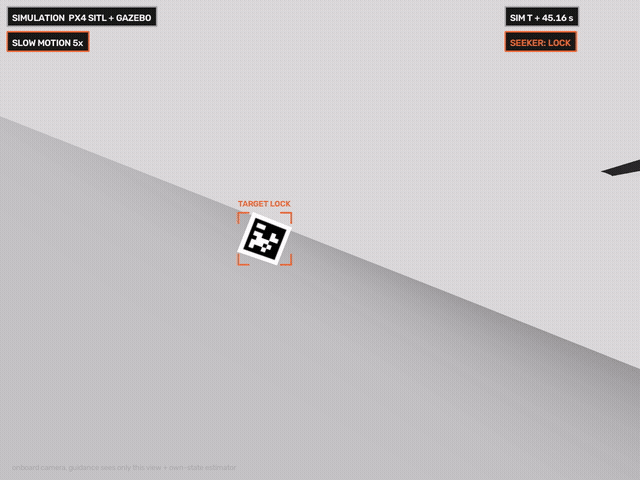
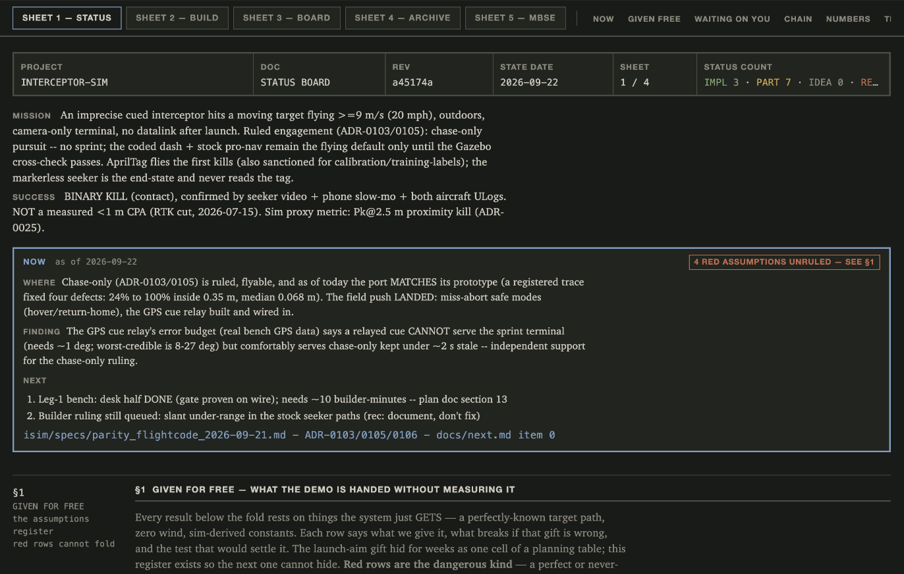
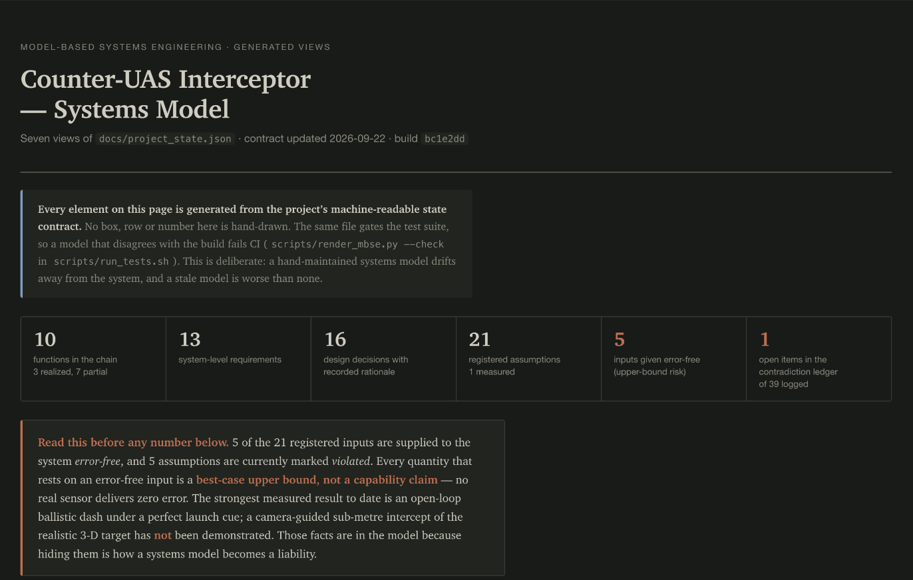

# Counter-UAS Interceptor — Sim-Proven Guidance, Real Build In Progress

[](https://github.com/Swampyemerson/interceptor-sim/actions/workflows/ci.yml)

A quadcopter interceptor that catches a moving target with its own camera.
The **ruled engagement (ADR-0103/0105) is a chase-only pursuit**: cued once
at the trigger by a GPS relay (latched, link dead after launch — **no
datalink in flight**), it flies a belief rendezvous to behind the target and
closes on camera measurements. The earlier **coded open-loop dash +
pro-nav terminal** remains the flying default only until a Gazebo
cross-check passes. Guidance was built and validated across a 107-ADR
measured campaign in **PX4 SITL + Gazebo Harmonic** plus a purpose-built
flight-code-in-the-loop Monte-Carlo simulator; the physical interceptor is
**on the bench** (motors soldered, flight-controller pack verified on-board,
Pi-to-Pixhawk OFFBOARD proven props-off).

<p align="center">
  
</p>
<p align="center"><sub>Onboard seeker view, simulation (PX4 SITL + Gazebo). Closest
approach 0.413 m against a 2 m/s crosser; retiming labeled on-screen; the
0.35 m contact bar is still open. Log: <code>logs/m4_intercept_pronav_20260923T025539Z.csv</code>.</sub></p>

**Status at a glance** (each row traces to the contract):

| | |
|---|---|
| Ruled design | chase-only pursuit (ADR-0103/0105); dash + pro-nav stay the flying default — the Gazebo cross-check **failed its registered bar** (below), so the swap is blocked |
| Flight-code port | matches its prototype in the fast sim (100% of 50 nominal runs ≤ 0.35 m, median 0.068 m); in Gazebo it chases camera-driven but closes only to median 1.51 m — **simulation, transfer gap open** |
| Not yet done | no camera-guided intercept inside the 0.35 m contact bar in Gazebo; no real-world intercept |
| Hardware | bench build under way; Pi 5 seeker measured 96.6 fps (AprilTag pipeline) |
| Honesty machinery | ground truth firewalled from guidance (AST-enforced); assumptions register grades every given input |

This is a portfolio project for aerospace internship applications. The claim
discipline is the point: every number below traces to a committed log, a gate
script, or an ADR in [`docs/decisions.md`](docs/decisions.md) — and the
project's retractions are documented with the same care as its wins, because
**the negative results are load-bearing**. The honest resume line:

> *"Camera-only terminal guidance validated by Monte-Carlo miss statistics in
> PX4/Gazebo SITL and a flight-code-in-the-loop simulator; ported the ruled
> pursuit terminal into the flight software to numeric parity with its
> prototype (100% of 50 seeded runs inside the 0.35 m contact radius, median
> 0.068 m, simulation); quantified the perception acquisition envelope and
> the flight-dynamic detector-recall limit."*

<p align="center">
  
  
  
</p>

**Canonical live state:** [`docs/project_state.json`](docs/project_state.json)
— the machine-readable contract (stage statuses, hard constraints, a
contradiction ledger, a dead-ideas graveyard, an assumptions register) —
rendered to [`docs/dashboard.html`](docs/dashboard.html) and the generated
MBSE views ([`docs/mbse.html`](docs/mbse.html)). Where anything in this README
and that contract disagree, **the contract wins**. Mission and scope history:
[`docs/goals.md`](docs/goals.md); milestone roll-up:
[`docs/progress.md`](docs/progress.md); working front:
[`docs/next.md`](docs/next.md).

**Read "What is proven / what is not" before the results table.** Several
headline-looking numbers from this project's own history were retracted by
its own audits; this README quotes only what survived. The long form of every
table caveat: [`docs/results_notes.md`](docs/results_notes.md).

---

## Current mission (the real build)

**A cued interceptor hits a moving target flying ≥9 m/s (20 mph), outdoors,
camera-only terminal, no datalink after launch.** The ruled engagement is
chase-only pursuit (ADR-0103/0105); the coded dash + stock pro-nav remain the
flying default only until the Gazebo cross-check passes. Success is a
**binary kill** (contact), confirmed by seeker video + phone slow-motion +
both aircraft flight logs — deliberately *not* a measured sub-meter CPA (the
RTK metrology pair was cut with the 2026-07-15 binary-kill re-scope). The
**first kills fly the AprilTag seeker** (96.6 fps measured on the Pi 5 CPU);
the markerless seeker is the end-state — the real-data retrain `n-mono`
(AP50 0.44 held-out) is the hardware default for that phase, pending the
Hailo NPU, and it never reads the tag. Source: `docs/project_state.json`
(goal), `docs/real_build_coded_dash.md`, `docs/hardware_order_list.md` §0b/§0c.

Hard constraints (full list + evidence in the contract): **no guidance
datalink after launch** (the GPS cue is latched at the trigger and the link
is dead from then on; the RC link is kill/arm only — jam resistance by
architecture, not protocol); **wide FoV (~100°) non-negotiable** (ADR-0024;
the ±30° figure it protected is a dash-era acquisition envelope); **prop
clearance is a geometry problem**, not a software one.

---

## What is proven, and what is not

**Proven (gated, committed evidence):**

- **The guidance law and loop.** Pro-nav (`a = N·Vc·λ̇`, N=5) beats pursuit
  4.6–7.6× on a 2 m/s crosser, camera-only (M4 gate); the two-stage
  dash→camera-terminal architecture holds to 12 m/s maneuvering targets
  against a cooperative (billboard/AprilTag-class) sensor picture. The
  portable [`flight/`](flight/) core (LOS derotation, alpha-beta estimation,
  pro-nav, undistortion, camera lever-arm) is pure math with its own test
  suite and no sim imports — it runs unchanged on the real Pi.
- **The methodology.** Paired seeds (n≥8), control arms, pre-registered
  verdict scripts, a numeric no-cheat audit on every guidance path, and a
  statistics-before-verdicts rule. This machinery caught every false
  positive below *before* it shipped.
- **The chase-only flight-code port.** The ruled pursuit terminal
  (`flight/pursuit_terminal.py`, a relative-state Kalman filter with
  capture-time attitude handling) runs through the unmodified flight state
  machine to **numeric parity with its prototype**: a registered tick-level
  trace found four coupled port defects, and the fixed port scores 100% of
  50 seeded nominal runs inside the 0.35 m contact radius, median 0.068 m
  (`isim/specs/parity_trace_2026-09-22.md`) — **simulation**. The
  pre-registered independent Gazebo cross-check then delivered both kinds of
  result: its shakedown flight caught a fifth port defect (a frozen Phase-A
  camera yaw, invisible to the isim grid, fixed and regression-pinned), and
  the scored n=8 **failed the registered bar** — the port chases
  camera-driven (46–67 detections consumed, zero aborts) but closes only to
  median 1.51 m vs the 0.122 m matched-optics prediction, so the
  default-terminal swap stays blocked and the transfer gap is the named next
  problem (`docs/xcheck_gazebo_pursuit_prereg.md`).

**Not proven — the honest wall (this is the interesting part):**

- **No camera-guided intercept of the realistic 3D quad target exists in the
  dataset.** When the flat billboard target was replaced with a proper 3D
  quad, a series of sub-meter "camera-guided" results were retracted as
  **open-loop dash-ballistics mirages** — a control arm with the camera
  contributing nothing scored the same (dash-only 0.30 m vs with-terminal
  0.29 m; ADR-0076 add #18g/#18h). Five such mirages were caught and
  retracted in that arc alone (ADR-0076; `docs/project_state.json`
  graveyard).
- **The binding wall is flight-dynamic detector recall, not guidance.** The
  deployed markerless detector reads **100% recall statically at 8–22 m**
  but **~0.8% on the approach in flight** (ADR-0076 add #18i/#18k). The
  un-eliminated mechanisms are ground-clutter background under the
  nose-down dash pitch and phantom competition — both sim-testable, both
  open. The dash pitches nose-down ~27–36° (median; ADR-0060), which parks
  a co-altitude target at the top of the frame; the pointing fix is a fixed
  up-tilt mount sized to the *measured* real dash pitch (build item, not
  yet validated).
- **The dash-era terminal had no vertical channel, and its miss was ~82%
  vertical** (ADR-0095/0099/0100): the fix arc moved sprint-only flights
  from 2/16 to 13/16 inside the contact radius — best case only (camera off,
  aim within ~±1° of optimum, target height known to ~0.1 m). The chase-only
  pursuit terminal steers all three axes; its own vertical behavior is what
  the current cross-check exercises. Full forensic history:
  [`docs/vertical_channel_analysis.md`](docs/vertical_channel_analysis.md).
- **"Works comms-denied" stays HELD** — see the box in the results section.


---

## Headline results (each traced; scope stated inline)

| Result | Number | Scope / caveat | Source |
|---|---|---|---|
| M0–M2 foundations (boot, camera, AprilTag detection) | detection rate 1.000, mean pose error 0.0861 m @ ~4.9 m | wide (99.7°) lens; sim lighting | gates `check_m0/1/2.sh`, 2026-07-04; `docs/progress.md` |
| M3 static intercept, hold 2 m standoff | final error **0.018 / 0.035 m** (bar < 0.5 m) | two verifier-confirmed runs | `scripts/check_m3.sh`; ADR-0008; committed `logs/m3_intercept_*.csv` |
| M4 pro-nav vs pursuit, 2.0 m/s crosser, camera-only | pro-nav **0.402 / 0.277 / 0.443 m** vs pursuit **2.544 / 2.109 / 2.048 m** | official gate-config runs; the dev-phase config selection that night is disclosed (ADR-0009 addendum; [notes](docs/results_notes.md#m4)) | `scripts/check_m4.sh`; ADR-0009; committed `logs/m4_intercept_*_20260705T03*.csv` |
| Two-stage handoff (S2), 6 m/s crosser | miss 1.1–2.3 m, handoff latches, honesty audits pass | proves the *architecture* (running start + structural handoff), not sub-meter precision; the S2 ground-stereo architecture is since retired | `retired/scripts/check_s2.sh`; ADR-0010/0013 |
| Why fast crossers miss ~1.4 m (41-flight forensics) | terminal correction capacity **½·a·t_go² ≈ 0.72 m** vs **1.69 m** already delivered at handoff → a perfect terminal camera cuts the miss only ~25% | miss tracks zero-effort-miss at handoff with r² = 0.96 — *variance explained*, not "96% of any one miss" | ADR-0023/0027; `retired/docs/terminal_diagnosis.md` |
| M5 final Monte-Carlo, n=96 (pursuit vs pro-nav × 6/9/12 m/s × line/maneuver/oblique) | **96.9% clean** (ran to completion and engaged; failures stay in every Pk denominator), mean miss 1.08 m, median 0.93 m; per-speed Pk per ADR-0025, never pooled | flew the **clean AprilTag sensor** (the disclosed perception upper bound), flat-board target; laws tied within the ~1 m run-to-run noise ([notes](docs/results_notes.md#m5)) | ADR-0036; `scripts/check_m5.sh`; committed `logs/mc_final_all.csv`; plots `docs/images/m5_*.png` |
| Markerless seeker v2 (kill the AprilTag) | false-detection pollution **0.751 → 0.000**, range honesty **0.056 → 0.935**; ~+1 m median miss vs the tag = bearing *quality* (box-center vs subpixel corners) | in-sim markerless; on real outdoor mono frames v2 scores **AP50 0.0003** (transfer bet lost) — the hardware seeker is the real-data retrain `n-mono` (AP50 0.44 held-out) | ADR-0038/0040/0042/0043; `scripts/check_seeker_v2.sh`; `logs/nn_tier/eval_n-mono_heldout.csv` |
| Chase-only flight-code port parity | port matches prototype: **100% of 50 seeded nominal runs ≤ 0.35 m, median 0.068 m**; aim-error 10°/20° cells 100%; target +2 m cell 68–76% (no-re-approach design gap) | **simulation** (flight-code-in-the-loop isim); a registered trace found and fixed 4+1 port defects — the fifth (a frozen Phase-A camera yaw) was caught by the Gazebo cross-check, invisible to the isim grid | ADR-0103/0105; `isim/specs/parity_trace_2026-09-22.md` |
| Gazebo cross-check of the chase (pre-registered, n=8) | camera-driven chase confirmed (46–67 detections/flight, 0 aborts) but CPA **0.55–2.33 m, median 1.51 m** — registered bar **FAILED**; default swap stays blocked | the honest transfer result: real EKF/control/latency dynamics cost ~1.4 m vs the fast sim's matched prediction (0.122 m); diagnosis next, not tuning | `docs/xcheck_gazebo_pursuit_prereg.md`; `logs/xcheck_gz_20260923_fixed/` |
| Detect-then-track maneuvering terminal (billboard era) | post-handoff camera-terminal Pk@2.5 m: weave **3/16 → 14/14**, jink **1/8 → 14/15** (paired n=16 baseline reads 3/15 → 14/15); phantom handoffs 12 → 0; zero gross (>8 m) false terminal detections (0/155) in the headline arm | one empty Gazebo world (disclosed); **the CSRT tracker was later dropped for the 3D quad target** — the deployed config is NN-only every frame (ADR-0076 add #2; [notes](docs/results_notes.md#t21)) | ADR-0058; committed `logs/mc_t21_*.csv`; `scripts/check_t21.sh` |
| Pk statistics hardening, n=72 | **Pk@2.8 m 72/72 — 95.0% Clopper-Pearson lower bound** (clears the ratified ≥95%-CI bar); Pk@2.5 m 71/72 = 98.6% point / 92.5% CP-LB | **flat-billboard target**, weave + 12 m/s only, never pooled, radius always stated; the 3D-quad target later exposed the wall this shape masked ([notes](docs/results_notes.md#pk72)) | ADR-0064/0025; committed `logs/mc_pk72_weave_s*.csv` |
| Perception wall, quantified | in-flight approach recall **0.8%** vs **100% static** at 8–22 m, same detector, same threshold | the wall is flight-dynamic (pointing + background + phantom competition), **not** range/resolution/aspect — each of those was tested and eliminated | ADR-0076 add #18i/#18k; `scripts/seeker/approach_recall.py` |
| Open-loop dash robustness | 48/48 flights still acquired/engaged with up to **±30° aim error** | dash-robustness only — *not* perception proof (ENGAGE streaks can be phantom, add #18g) | ADR-0076 add #18b/#18c |


> **Comms-denied status: HELD — tested, not merely untested.** The one-way
> handoff latch is real and structural: once the camera terminal latches, the
> cue channel is closed and unreadable, so a link jammed *after* handoff
> cannot touch the terminal. But the flown 8-arm jam Monte-Carlo (ADR-0059)
> showed the cue-era deployment config **fails closed** under a jam
> *before* camera acquisition (real handoffs 12/16 → 2/16 → 0/16 as the jam
> moves earlier — a clean dose-response witness); the staleness fix
> validated **fail-safe, not recovery**, and a dedicated recovery arm was an
> honest NULL (the camera never reacquired at 15–21 m — a perception limit,
> not guidance). So "works comms-denied" is **HELD everywhere in this
> project's materials**. The real build's answer is architectural: the GPS
> cue is **latched at the trigger and the link is dead after launch** — there
> is no in-flight link to jam. That machine has not flown, so nothing is
> claimed for it.

Superseded results (ADR-0028/0030/0031 running-start and degraded-cue
figures, the ADR-0029 hover-geometry regime map, the cue-era fusion numbers)
are kept in `docs/decisions.md` with their supersession notes and are not
quoted here.

---

## Architecture (ruled: chase-only pursuit; flying default: coded dash, pending cross-check)

```
CUE         GPS cue relayed once and LATCHED AT THE TRIGGER (a given input,
            graded in the assumptions register); link dead after launch
   ↓
PHASE A     belief rendezvous: fly to a point behind the believed target,
            match its speed; camera yaws at the believed target
DETECT      AprilTag tag36h11 on every frame (first kills; 96.6 fps measured
            on the Pi 5); markerless n-mono is the end-state seeker
MEASURE     tag box + intrinsics → bearing; box width → range (slant-
            corrected), converted with attitude at frame-CAPTURE time
ESTIMATE    relative-state Kalman filter (position + target velocity);
            delayed-measurement update, coasts dropouts
PHASE B     camera close: v = v̂_target + v_close·LOS + k·(predicted miss);
            a missed pass aborts to SAFE hover (ADR-0107)
ACT         velocity setpoints → PX4 OFFBOARD (MAVSDK), unmodified flight
            state machine (flight/deploy/real_flight.py)
   ↓
KILL        sim: ground truth scoring-only; real: binary kill on video +
            both aircraft logs (contact bar 0.35 m, ADR-0084)
```

The retired sprint-era loop (coded dash → streak handoff → LOS-rate pro-nav,
NN-only detector) remains the **flying default** until the Gazebo cross-check
passes, and is preserved in the contract's stage notes. The portable
[`flight/`](flight/) package has no gz/ground-truth/cue imports (enforced by
AST-based honesty tests) and runs unchanged on the real Pi
(`scripts/check_deploy_sitl.sh`, props-off bench gate passed on hardware).

**Honesty boundary (unchanged since M0):** `gt_*` ground-truth topics are
scoring/logging only; guidance sees camera pixels + own-state EKF, nothing
else. Every gate re-derives the numeric no-cheat check, and
`tests/test_honesty_static.py` / `tests/test_honesty_seekers.py` pin it
statically (AST scans over every live seeker module, mutation-calibrated).


---

## The real build (Tier-1, in progress)

**Status 2026-09-23 — assembly under way.** Motors are soldered to the ESC,
the flight controller's 44-parameter pack is verified on the board (read back
across a reboot), the GPS/compass is talking on GPS1, and the Pi-to-Pixhawk
MAVSDK OFFBOARD link is proven props-off — the one link the simulation never
exercised. Remaining before first power-up: the battery pigtail + continuity
checks, then the smoke-stopper gate (`docs/project_state.json` build_tab).

**Earlier — 2026-08-10 — the hardware measured.** The Pi 5 seeker
rig runs the real camera (1280×800 mono, exposure **994 µs**, inside the ≤1 ms
spec), the flight controller passes **MAVSDK OFFBOARD over a real serial UART with
props off** — the one link the simulation never exercised — and the deployed camera
source was measured **on hardware at 60.27 fps** (114.9 uncapped). Along the way
the seeker was found to have been running at 30 fps purely because nobody had set a
frame-duration limit; lifting it cuts the range burned forming the handoff by about
3.2× (ADR-0090).

> **The scorer measures the wrong point, and the correction is SMALL.** The
> miss-distance scorer ranges to the **camera**, not the airframe centre the kill
> criterion is defined against (ADR-0084). Re-scored properly with a purpose-built
> offline tool, the adopted config moves from **3/16 to 5/16** inside the 0.35 m ram
> radius — the interpolation between logged samples is worth ~0.03–0.06 m and is
> real, but it is a modest correction, not a reversal.
>
> **An earlier version of this note claimed 12/16, and that was wrong.** It rested
> on a figure of "+0.208 m camera lens above the airframe datum", which turned out
> not to be a lever arm at all: it was `gt_cam_z − alt_m`, differencing a *world* z
> against MAVSDK's *relative* altitude, so it measured the **landing gear's height**.
> Three independent routes — the SDF chain, the collision geometry, and the on-pad
> telemetry — put the camera **~2 mm** above the airframe datum and 0.120 m forward
> of it. The real correction is therefore almost entirely **horizontal**.
>
> **So the headline stands: nothing has yet landed inside the ram radius reliably**,
> and the largest remaining term is a **vertical** one (median −0.374 m — the
> interceptor flies low), on a vehicle whose targeting math is explicitly 2-D
> horizontal. That gap is real and unclosed. All of these numbers still assume a
> perfect launch cue, co-altitude flight and no wind. Detail:
> [`docs/rescore_2026-08-10.md`](docs/rescore_2026-08-10.md).

**Earlier — 2026-07-25 — Tier-1 fully ordered** (target-drone stack, seeker
kit, interceptor flight controller, consumables), after the what's-left push
([`retired/docs/audit_2026-07-25_whats_left.md`](retired/docs/audit_2026-07-25_whats_left.md))
closed the desk backlog: the **ram/kill radius ratified at 0.35 m** (ADR-0084 —
the ordered 5-inch pair's contact envelope, so every Pk figure is quoted
against a radius the hardware can actually deliver), the field-day P0s closed,
the print artifacts dimensionally verified, `FAILSAFE 7` and the kill-day
protocol written, and CI brought green. The Tier-1 software layer — Pi 5
session recorder, the two-curve money-gate scorer, binary-kill metrology from
both aircraft logs, the SITL-validated OFFBOARD deploy loop — is adversarially
reviewed. The in-person ladder with its go/no-go money gates lives in
`docs/project_state.json` (`build_plan`) and
[`docs/hardware_order_list.md`](docs/hardware_order_list.md); a gate failure
loops back to the cheapest upstream fix, never forward to more spend.


---

## Methodology (the rules that caught the mirages)

- **Lab ranks, Gazebo decides.** The point-mass guidance lab screens ideas;
  only a Gazebo gate turns a ranking into a conclusion. The lab was wrong in
  the optimistic direction five documented times (PIP, Kalata gains,
  emit-vs-differentiate, fusion coverage, absolute miss).
- **Statistics before verdicts.** Run-to-run noise is ~1 m; single-flight
  deltas below that are noise. A/B claims need paired seeds (n≥8) and
  mechanism evidence, with honest "not significant at this n" language.
- **Anti-mirage rule** (earned, not decorative): any new "win" needs a
  control arm (dash-only / ground-truth-consistent audit), paired seeds, and
  validation on held-out *flights* — never frame-eval, never single-seed.
  This is the rule that caught all five coded-dash mirages.
- **Simulate worse than ideal.** Design numbers carry BEST / EXPECTED /
  WORST-credible tiers; decisions must survive WORST.
- **Sim time, never wall time**, and batches only on an idle machine
  (measured RTF-under-load confound, ADR-0009/0015).
- **The graveyard is binding.** Dead ideas (foveated crop, v3/rebal
  retrains, range-plausibility gates, APN/Kalman-CA-PIP, narrow lens, sim
  pivot, onboard acoustics…) are recorded with the evidence that killed
  them, and are not resurrected without new evidence
  (`docs/project_state.json`).

Known sim-to-real gaps are cataloged, not hidden: no motion blur, no
vibration, no outdoor clutter or lighting in the sim
(`docs/sim_to_real_gaps.md`); the tripod session exists precisely to measure
what the sim cannot.


---

## Systems engineering, generated — not hand-drawn

The system model is **generated from the contract**, and the test suite fails
if the rendered views drift from it — so the model cannot disagree with the
build. `docs/project_state.json` holds ~10 pipeline stages with status and
active version, hard constraints, a contradiction ledger (claims challenged
by evidence, resolved in place), a dead-ideas graveyard, and an assumptions
register that grades every input the system is *given* rather than measures
(`measured` / `given-noisy` / `given-perfect` / `unmeasured`) — a number
computed on a `given-perfect` input is reported as a best-case upper bound,
never as the claim.

<p align="center">
  
  
</p>

Renderers: [`scripts/render_dashboard.py`](scripts/render_dashboard.py) (the
status board + the drift gate) and
[`scripts/render_mbse.py`](scripts/render_mbse.py) (functions, requirements,
quantities, and their trace links). Views:
[`docs/dashboard.html`](docs/dashboard.html) ·
[`docs/mbse.html`](docs/mbse.html).


---

## Reproduce it

Everything runs headless and writes CSV telemetry to `logs/`. The key
evidence CSVs behind every number quoted above are **committed** (M3/M4
gates, `mc_final_*`, `mc_t21_*`, `mc_pk72_*`, jam-MC and up-tilt arms); bulk
per-run logs are gitignored and regenerable. All Python runs through the
project venv (`.venv/bin/python`).

**60-second check, no sim install** — from a fresh clone, only Python needed:

```bash
python3 -m venv --system-site-packages .venv && .venv/bin/pip install -r requirements.txt
.venv/bin/python -m pytest tests/ flight/tests/  # the offline suite (a few files need the apt gz bindings; CI deselects them when absent)
python3 scripts/render_dashboard.py --check      # the contract/dashboard drift gate (stdlib-only)
scripts/check_t21.sh                             # re-asserts the ADR-0058 headline from committed CSVs
```

**Requirements:** Ubuntu 24.04, PX4-Autopilot (SITL) + Gazebo Harmonic,
Python 3.12, `pip install -r requirements.txt` (plus the apt-installed
`python3-gz-transport13`/`python3-gz-msgs10` bindings — see
`requirements.txt` comments).

**Tests (sim-free, CI-runnable):**

```bash
scripts/run_tests.sh        # offline suite (.venv) + the project-state
                            # dashboard/MBSE drift checks + tool self-tests
```

**Milestone gates** (each a scripted pass/fail, exit 0 = pass; needs the sim
stack): `scripts/check_m0.sh` … `check_m5.sh`, `check_deploy_sitl.sh`
(the retired S1/S2 gates live under `retired/scripts/`). **Monte-Carlo batches** (the evidence machine):
`scripts/mc_batch.sh` + `scripts/mc_analyze.py`.
One sim at a time, idle machine only — batch numbers are only comparable at
matched load. `scripts/env/bootstrap.sh` recreates the config files on a fresh VM; a
normal clone doesn't need it.


---

## Repo map

`flight/` — the portable real-build guidance core + its tests (no sim imports;
runs on the Pi). `scripts/` — sim harnesses, milestone gates, the Monte-Carlo
runner/analyzer, the seeker lane (`seeker/`), the contract renderers.
`worlds/`, `models/` — Gazebo worlds and targets. `docs/` — the contract +
rendered views, the full ADR log (`decisions.md`), design docs, the runbooks.
`logs/` — committed evidence CSVs (everything else gitignored). `tests/` — the
offline suite, including the AST-based honesty pins. `isim/` — the fast
flight-code-in-the-loop Monte-Carlo simulator (vehicle model fitted to 345
logged Gazebo flights). `retired/` — superseded work (S2 ground-stereo, the
T25 demo pipeline, old forensics), kept for provenance, never deleted.

## Built with AI, disclosed

This project was built by the author working with Claude (Anthropic's coding
agent) under the honesty machinery documented above — the AI wrote most of the
code and flew most of the batches; the author set the goals, made the calls,
and asked the questions that caught the biggest overclaims. The process,
including what the AI got wrong along the way, is logged in
[`docs/build_log.md`](docs/build_log.md). Every number still traces to a
committed run or a written derivation; none of the claims rest on the AI's
say-so.

## License

Code and docs: **MIT** (`LICENSE`). The fine-tuned detector **weights are
not in this repo** (gitignored) and carry a separate licensing nuance
(AGPL-3.0 upstream tooling) — see
[`docs/license_notice_weights.md`](docs/license_notice_weights.md) before
redistributing any weights file.
