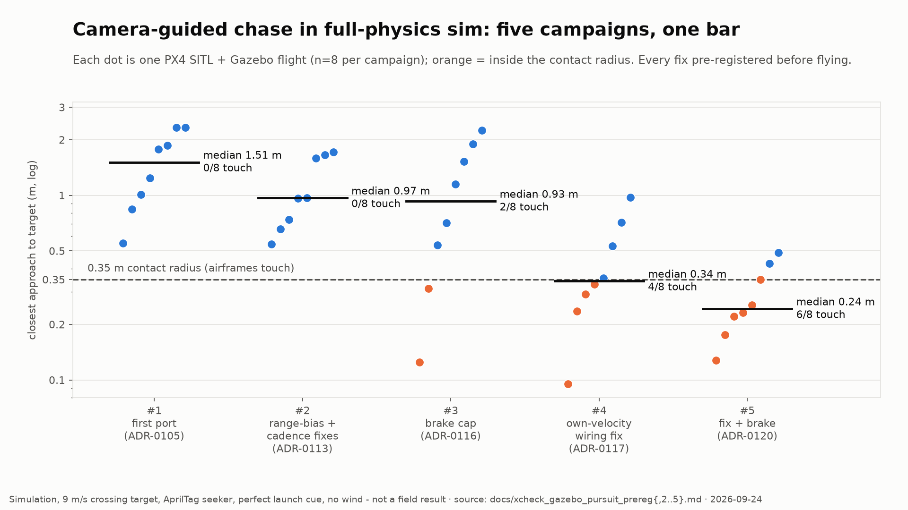
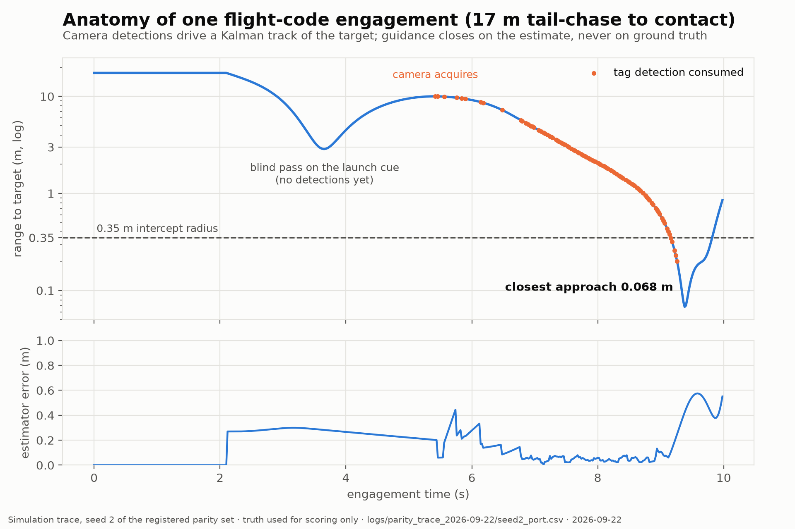

# Counter-UAS Interceptor — Camera-Guided Chase, Sim-Proven, Real Build In Progress

[](https://github.com/Swampyemerson/interceptor-sim/actions/workflows/ci.yml)

A small quadcopter that catches a moving drone using only its own camera.
A ground sensor gives it **one** GPS cue at launch; after that the link is
dead and the interceptor is on its own. It flies to a point behind the
target, finds it in the camera, tracks it with a Kalman filter, and closes
until the two airframes touch.

The chase has been designed, ported into the real flight software, and
passed its bar in full-physics simulation (PX4 SITL + Gazebo). The physical
aircraft is being built now. **No real-world intercept has happened yet.**

<p align="center">
  
</p>
<p align="center"><sub>Five pre-registered Gazebo campaigns, same pass bar throughout. Each fix
was written down with its prediction <i>before</i> flying. Simulation only: perfect launch cue,
no wind, AprilTag on the target. Regenerate: <code>scripts/plot_xcheck_arc.py</code>.</sub></p>

**Status at a glance** (each row traces to [`docs/project_state.json`](docs/project_state.json)):

| | |
|---|---|
| Engagement | **chase only** (fly behind the target, close on camera) — the flying default since ADR-0118 |
| Full-physics sim | **median miss 0.24 m, 6/8 flights inside the 0.35 m contact radius** (Gazebo, n=8, ADR-0120) |
| Fast sim, flight code in the loop | 100% of 50 seeded runs inside 0.35 m, median 0.068 m (nominal cue) |
| Hardware | seeker (Pi 5 + global-shutter camera) runs at **96.6 fps measured**; flight controller ↔ Pi link proven props-off; interceptor airframe parts arriving Oct 2026 |
| Not done | no real-world intercept; the sim results assume a perfect launch cue and no wind |

This is a portfolio project for aerospace internship applications. The
point is claim discipline: every number traces to a committed log, a gate
script, or an ADR in [`docs/decisions.md`](docs/decisions.md), and the
project's retractions are documented as carefully as its wins. The honest
resume line:

> *"Built camera-only terminal guidance for a quadcopter interceptor and
> validated it in PX4/Gazebo SITL through five pre-registered Monte-Carlo
> campaigns (median miss 1.51 m → 0.24 m, 6/8 inside a 0.35 m contact
> radius); ported it into flight software at numeric parity with its
> prototype; found and fixed a velocity-wiring defect that would have flown
> on the real aircraft."*

<p align="center">
  
</p>
<p align="center"><sub>Anatomy of one engagement (fast sim, flight code in the loop): a blind pass on
the launch cue, then camera detections drive the Kalman track to contact. Ground truth is used only
to score it.</sub></p>

**Canonical live state:** [`docs/project_state.json`](docs/project_state.json)
— the machine-readable contract (stage statuses, hard constraints, a
contradiction ledger, a dead-ideas graveyard, an assumptions register) —
rendered to [`docs/dashboard.html`](docs/dashboard.html) and
[`docs/mbse.html`](docs/mbse.html). **Where this README and the contract
disagree, the contract wins.** Working front: [`docs/next.md`](docs/next.md).

---

## Mission

**Hit a target drone flying ≥9 m/s (20 mph), outdoors, with a camera-only
terminal and no datalink after launch.** Success is a **binary kill**
(contact), confirmed by seeker video, phone slow-motion, and both aircraft's
flight logs. The contact radius is **0.35 m** — the sum of the two 5-inch
airframes' half-spans (ADR-0084), so "inside 0.35 m" means they physically touch.

Hard constraints (full list in the contract):
- **No guidance datalink after launch.** The GPS cue is latched at the
  trigger; the RC link is kill/arm only. Jam resistance comes from the
  architecture, not a protocol.
- **Wide field of view (~100°)** — non-negotiable (ADR-0024).
- **The first kills fly an AprilTag** (a printed fiducial marker) on the
  target, decoded on the Pi 5 CPU. A markerless neural-net seeker is the
  end state; it never reads the tag.

---

## How it works

```
CUE       one GPS fix of the target, relayed at the trigger, then the link is dead
            (a given input — graded in the assumptions register, see below)
   ↓
PHASE A   fly to a point behind where the target should be, match its speed;
          camera yaws toward the believed target
DETECT    AprilTag decode on every frame (96.6 fps measured on the Pi 5)
MEASURE   tag corners + camera intrinsics → bearing; tag size → range,
          using the vehicle attitude at the moment the frame was captured
ESTIMATE  relative-state Kalman filter (target position + velocity);
          handles late measurements, coasts through dropouts
PHASE B   close: velocity = target velocity + closing speed along the line of
          sight + a correction for the predicted miss; a stopping-distance
          brake caps the approach speed (ADR-0120). A missed pass → safe hover.
ACT       velocity setpoints → PX4 OFFBOARD over MAVSDK
   ↓
KILL      sim: ground truth used for scoring only · real: contact on video + logs
```

The camera sits on a +10° up-tilted bracket and the target's tag is canted
12° down. They were adopted as a pair so the tag stays readable while the
target flies pitched nose-down (ADR-0114). A config-gated **rehearsal break-off** turns a
real pass into a practice pass that peels away before contact. It passed
a Gazebo spot-check with 6/6 clean escapes (closest 2.3–2.7 m), so the first
field passes can be flown without risking the airframes.

The guidance core in [`flight/`](flight/) is pure math with no simulator or
ground-truth imports (enforced by AST-based tests), and runs unchanged on
the real Pi (`flight/deploy/real_flight.py`).

**Honesty boundary:** `gt_*` ground-truth topics are for scoring and logging
only. Guidance sees camera pixels and its own-state EKF, nothing else.
Pinned statically by `tests/test_honesty_static.py` /
`tests/test_honesty_seekers.py` and re-checked numerically on every gate.

---

## What is proven, and what is not

**Proven (simulation, gated, committed evidence):**

- **The chase meets its bar in full-physics sim.** Five pre-registered
  Gazebo campaigns with n=8 fresh-boot flights each, same bar every time.
  Median closest approach went 1.51 → 0.97 → 0.93 → 0.34 → **0.24 m**, and
  6/8 flights ended inside the contact radius (ADR-0113 → 0120,
  `docs/xcheck_gazebo_pursuit_prereg{,2,3,4,5}.md`).
- **The flight code matches its prototype.** A tick-by-tick trace found
  four coupled port defects, and the Gazebo cross-check caught a fifth.
  Fixed, the port scores 100% of 50 seeded runs inside 0.35 m, median
  0.068 m, in the fast flight-code-in-the-loop sim
  (`isim/specs/parity_trace_2026-09-22.md`).
- **The cross-check loop caught a real hardware bug.** The flight driver
  read the vehicle's *speed* but not its velocity vector, so the Kalman
  filter was fed the last *commanded* velocity, 3.6–4.2 m/s off. That
  defect was in the real driver and would have flown. Fixing it moved the
  median from 0.93 m to 0.34 m (ADR-0117).
- **Guidance fundamentals.** Proportional navigation beat pure pursuit
  4.6–7.6× on a 2 m/s crosser, camera-only (M4 gate). Static standoff held
  to 0.018–0.035 m (M3 gate).

**Not proven — the honest limits:**

- **No real-world intercept.** Every result above is simulation.
- **The sim results use a perfect launch cue.** The cue is graded
  `given-perfect` in the assumptions register, so these numbers are a
  **best-case upper bound**. The GPS relay's worst-credible aim error is
  8–13°. In the fast sim the ported chase still reached 100% contact with
  10° and 20° of aim error. Gazebo has not flown with cue error yet.
- **No wind, an upright tag, and a simulated camera** in the Gazebo runs.
  Real motion blur, vibration, and outdoor lighting are cataloged in
  [`docs/sim_to_real_gaps.md`](docs/sim_to_real_gaps.md). The tripod
  session exists to measure them.
- **The markerless seeker is not flight-ready.** In the earlier sim era,
  the neural-net detector saw the target on 100% of static frames at
  8–22 m but only **0.8% on the approach in flight**. The cause was
  pointing: the target sat outside the frame. It was not a recognition
  failure (ADR-0076). The real-data retrain `n-mono` reaches AP50 0.44 on
  held-out real images, but it has not flown. That is why the first kills
  fly the tag.

---

## Headline results (each traced; scope inline)

| Result | Number | Scope | Source |
|---|---|---|---|
| Gazebo chase cross-check, latest | **median 0.24 m, 6/8 inside 0.35 m**, 0 aborts, camera-driven | sim; perfect cue, windless, 9 m/s crosser, n=8 | ADR-0120; `docs/xcheck_gazebo_pursuit_prereg5.md` |
| Gazebo campaign arc | 1.51 → 0.97 → 0.93 → 0.34 → 0.24 m median | five registered campaigns, one unchanged bar | `docs/xcheck_gazebo_pursuit_prereg{,2..5}.md` |
| Flight-code port parity | 100% of 50 runs ≤ 0.35 m, median 0.068 m; aim error 10° and 20°: 100%; target 2 m high: 68–76% | fast sim (isim, vehicle model fitted to 345 Gazebo flights) | ADR-0105; `isim/specs/parity_trace_2026-09-22.md` |
| Rehearsal break-off | 6/6 clean escapes, separations 2.3–2.7 m | Gazebo spot-check | `docs/rehearsal_gazebo_spotcheck_prereg_2026-09-24.md` |
| Seeker frame rate on the Pi 5 | **96.6 fps** (750 s soak, no throttling; the project had assumed 30) | real hardware | ADR-0090; `scripts/seeker/pi_fps_soak.py` |
| Real-data detector (markerless, end-state) | AP50 **0.44** vs 0.0003 for the sim-trained model; false-fire 4.9% vs 88.5% | held-out public real images; not yet flown | `logs/nn_tier/eval_n-mono_heldout.csv` |
| M4: pro-nav vs pursuit, 2 m/s crosser | pro-nav 0.28–0.44 m vs pursuit 2.05–2.54 m | camera-only, identical paths | `scripts/check_m4.sh`; ADR-0009 |
| M3: static standoff | 0.018 / 0.035 m error (bar < 0.5 m) | two verifier-confirmed runs | `scripts/check_m3.sh`; ADR-0008 |

**Earlier architecture, kept for history, not current claims.** Before the
chase, the design was an open-loop "coded dash" with a pro-nav camera
terminal. That era produced the M5 Monte-Carlo (n=96, flat-billboard
target) and billboard-target Pk figures. It also produced five sub-meter
"camera-guided" results against a 3D quad target that turned out to be
open-loop dash ballistics: a control arm with the camera contributing
nothing scored the same. All five were retracted (ADR-0076). The dash-era
numbers and their caveats live in
[`docs/results_notes.md`](docs/results_notes.md) and the contract's
graveyard.

---

## The real build

| Subsystem | State |
|---|---|
| **Seeker rig** — Raspberry Pi 5 + OV9281 global-shutter mono camera | in hand; 96.6 fps measured; exposure 994 µs; frame recorder built |
| **Interceptor brain** — Pixhawk 6C Mini + M10 GPS | in hand; parameter pack verified across a reboot; Pi ↔ Pixhawk MAVSDK OFFBOARD proven props-off |
| **Interceptor airframe** — 5-inch frame, ESC, motors, receiver, BEC | ordered 2026-09-22, arriving ~Oct 5–15 (ADR-0109) |
| **Target drone** — ArduPilot 5-inch quad carrying the tag | frame, ESC, motors, GPS, receiver built; flight controller's sensor bus found dead, replacement ordered |

Next physical rungs: the tripod session measures the real camera's tag
decode envelope. After that come the powered interceptor build, rehearsal
passes, and then a kill attempt. The go/no-go ladder is in the contract
(`build_plan`) and [`docs/hardware_order_list.md`](docs/hardware_order_list.md).
A gate failure loops back to the cheapest upstream fix, never forward to
more spending.

---

## Methodology (the rules that caught the mirages)

- **Pre-register before you fly.** The config, the prediction, the pass bar,
  and what a null would mean are written down before a campaign runs.
  Every Gazebo campaign above was registered this way, including the ones
  that failed.
- **Statistics before verdicts.** Paired seeds (n≥8), control arms, and
  honest "not significant at this n" language. Run-to-run noise was
  measured, not assumed.
- **Instruments are evidence.** A bug in a scorer invalidates every run it
  scored, and a paired control can't see it. Most of this project's
  retractions traced to measurement code, not experiment design.
- **Assumptions are first-class.** Every input the system is *given* rather
  than *measures* is graded `measured` / `given-noisy` / `given-perfect` /
  `unmeasured`. A number built on a `given-perfect` input is a best-case
  bound, never the claim.
- **Fast sim ranks, Gazebo decides.** The fast sim screens thousands of
  runs. Only a Gazebo campaign turns a ranking into a conclusion.
- **The graveyard is binding.** Dead ideas are recorded with the evidence
  that killed them and are not resurrected without new evidence.

---

## Systems engineering, generated — not hand-drawn

The system model is **generated from the contract**, and the test suite
fails if the rendered views drift from it, so the model cannot disagree
with the build.

<p align="center">
  
  
</p>

Renderers: [`scripts/render_dashboard.py`](scripts/render_dashboard.py) (status
board + drift gate) and [`scripts/render_mbse.py`](scripts/render_mbse.py)
(functions, requirements, quantities, trace links).

---

## Reproduce it

Everything runs headless and writes CSV telemetry to `logs/`. The evidence
CSVs behind the gate numbers are committed. Bulk per-flight logs are
gitignored and regenerable.

**60-second check, no sim install** (only Python needed):

```bash
python3 -m venv --system-site-packages .venv && .venv/bin/pip install -r requirements.txt
.venv/bin/python -m pytest tests/ flight/tests/  # offline suite (a few files need the apt gz bindings; CI deselects them when absent)
python3 scripts/render_dashboard.py --check      # contract/dashboard drift gate (stdlib-only)
```

**Full stack:** Ubuntu 24.04, PX4-Autopilot (SITL) + Gazebo Harmonic,
Python 3.12, `pip install -r requirements.txt` plus the apt
`python3-gz-transport13` / `python3-gz-msgs10` bindings. `scripts/run_tests.sh`
runs the offline suite and drift checks. Milestone gates are
`scripts/check_m0.sh` … `check_m5.sh` and `check_deploy_sitl.sh`, each
exiting 0 on pass. Run one simulation at a time, on an idle machine.

---

## Repo map

`flight/` — portable guidance core + tests (no sim imports; runs on the Pi).
`isim/` — fast flight-code-in-the-loop Monte-Carlo sim (vehicle model fitted
to 345 logged Gazebo flights). `scripts/` — sim harnesses, gates, Monte-Carlo
tooling, seeker lane, contract renderers. `worlds/`, `models/` — Gazebo
assets. `docs/` — the contract, rendered views, ADR log, pre-registrations.
`logs/` — committed evidence CSVs. `tests/` — offline suite including the
honesty pins. `retired/` — superseded work, kept for provenance.

## Built with AI, disclosed

Built by the author working with Claude (Anthropic's coding agent) under the
honesty machinery above. The AI wrote most of the code and flew most of the
batches. The author set the goals, made the calls, and asked the questions
that caught the biggest overclaims. The process, including what the AI got
wrong, is logged in [`docs/build_log.md`](docs/build_log.md).

## License

Code and docs: **MIT** (`LICENSE`). Fine-tuned detector weights are not in
this repo and carry a separate licensing nuance (AGPL-3.0 upstream tooling).
See [`docs/license_notice_weights.md`](docs/license_notice_weights.md).
