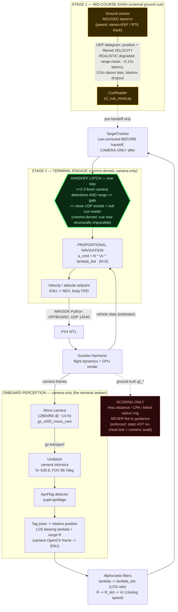

# DELIVERABLE A — ARCHITECTURE DIAGRAM

## A1. Mermaid (paste into any Mermaid renderer / GitHub README)



Legend: amber = mocked ground-sensor stand-in; green thick hexagon = the one-way HANDOFF (the headline beat); dashed red = the honesty boundary (ground truth is scoring-only, never fed to guidance).

## A2. ASCII fallback (drops into a plain-text README / terminal)

```
                    STAGE 1: MID-COURSE DASH (external ground cue)
   +-----------------------------------------------------------------------+
   |  Ground sensor  --UDP: position + filtered VELOCITY-->  CueReader      |
   |  (MOCKED stand-in;      REALISTIC degraded cue:         s2_cue_mock.py |
   |   parent = stereo+EKF   noise / ~0.12s latency /              |        |
   |   or RTK track)         0.5m datum bias / dropout            (pre-     |
   +---------------------------------------------------------------|handoff)+
                                                                    :  only
   ONBOARD PERCEPTION  (camera-only -- the terminal seeker)         :
   +----------------------------------------------------------+     :
   | Mono camera  --gz-transport-->  Undistort  -->  AprilTag |     :
   | 1280x960 @14Hz                  (fx~539.9,      detector |     :
   | gz_x500_mono_cam                 FOV 99.7deg)   (pupil-  |     :
   |                                                 apriltags)|    :
   |            --> Tag pose -> rel. position: LOS bearing     |    :
   |                lambda + range R  (OpenCV cam frame->ENU)  |    :
   +-------------------------------|--------------------------+     :
                                   v                                :
                      ALPHA-BETA FILTERS                            :
                   lambda -> lambda_dot (LOS rate)                  :
                   R -> R_dot -> Vc (closing speed)                 :
                                   |                                :
                                   v                                v
                          +----------------------------------------------+
                          |  TargetTracker: cue-corrected BEFORE handoff,|
                          |                 CAMERA-ONLY after            |
                          +----------------------|-----------------------+
                                                 v
              ####################################################
              #   >>> HANDOFF LATCH  (ONE-WAY, comms-denied) <<<  #
              #   >=2-3 fresh camera detections AND range<=gate    #
              #   => close UDP socket + null cue reader            #
              #   (external cue now STRUCTURALLY impossible)       #
              ####################################################
                                                 |
                    STAGE 2: TERMINAL ENGAGE (camera-only)
                                                 v
                       PROPORTIONAL NAVIGATION
                       a_cmd = N * Vc * lambda_dot   (N = 5)
                                                 |
                                                 v
                       Velocity/attitude setpoint  (ENU->NED, body FRD)
                                                 |
                            MAVSDK-Python OFFBOARD (UDP 14540)
                                                 v
       +-------------------+   camera frames    +----------------------------+
       |     PX4 SITL      |<-------------------|      Gazebo Harmonic        |
       |                   |--vehicle state---->|  (flight dynamics + render) |
       +-------------------+                    +--------------|--------------+
                                                               : ground truth (gt_*)
                                                               v
        ===========================================================
        ||  HONESTY BOUNDARY -- gt_* is SCORING ONLY:            ||
        ||  miss distance / CPA / lethal-radius ring.            ||
        ||  NEVER fed to guidance.                               ||
        ||  Enforced: static AST no-cheat test + numeric audit.  ||
        ===========================================================
```

Frame conventions (label on the diagram slide): World = ENU (origin at interceptor start); Camera = OpenCV (z fwd, x right, y down); Body = FRD. Phases in code: `TAKEOFF -> CUE_WAIT -> DASH -> [HANDOFF latch] -> ENGAGE -> BREAKOFF`. Note "HANDOFF" is a latch event, **not** a phase value — the HUD synthesizes it from `ext_fresh` going 1->0.

---

# DELIVERABLE B — DEMO VIDEO (BUILT — shot list + the shipped cut)

> **STATUS UPDATE (2026-07-07): the demo is BUILT and shipped (ADR-0032).** ffmpeg is now
> installed (`/usr/bin/ffmpeg`), and the reel is assembled offline by **`scripts/build_demo.py`**
> (not the older `compose_demo.sh`) from a real hero flight — no live sim needed to re-render.
> The shot list below is the plan the finished cut was built from; the specifics that changed
> in the build (hero number, OSD de-cringe) are reconciled inline. Full build documentation
> lives in `demo_out/README.md`.

**Shipped assets (`demo_out/`, gitignored — regenerable):**
- `interceptor_onboard.mp4` (~20 s, 1280x960) — **PRIMARY**: the interceptor's own camera with
  the FPV OSD HUD overlaid, ending on the proximity-fuse close-out.
- `interceptor_onboard.gif` (~3 MB) — README highlight loop (handoff → fuse).
- `interceptor_chase.mp4` (~3.8 s, 960x540) — **SECONDARY**: the same intercept from the world
  chase camera + a compact HUD.
- Legacy first-pass `interceptor_demo.{mp4,gif}` (sidebar-HUD compose_demo.sh output) are kept but
  superseded. Committed stills: `docs/images/demo_onboard_final.png`, `demo_chase_final.png`.

**Hero flight (what actually shipped) = the ADR-0030 running-start + dash-track-fix config under
the REALISTIC degraded cue:** 9 m/s crossing target, pro-nav terminal (N=5), cue-seed 31, miss
**0.632 m** (source: `demo_out/README.md` build log, which cites
`logs/m4_intercept_pronav_20260707T211601Z.csv`; CPA at `t_sim=20.528 s`, `gt_range=0.6324`), handoff
latched. **Reconciliation note (cross-checked against `docs/decisions.md`):** the original ADR-0032
entry recorded only the *first* capture, **1.061 m**; the **ADR-0032 addendum (decisions.md,
2026-07-08)** then logged the **0.632 m** re-cut and rules it the number to prefer (the shipped
`demo_out/*` assets are built from it). Treat **0.632 m as the shipped-asset number** and
**1.061 m as the first-capture number**; portfolio docs lead with the honest **~1.19 m mean**
and cite the hero as one take. Both traces are real runs of the same frozen config (below),
consistent with the ~1.19 m mean under the ~1 m run-to-run terminal-dropout noise (see honesty note next). This doc is in the
portfolio-docs lane and cannot edit `docs/decisions.md`; flagging here for a future ADR-0032 addendum
that records the 0.632 m re-cut. **Log-file caveat:** `logs/` is gitignored and regenerable, and the
Monte-Carlo batch running in this repo actively writes/prunes that directory — the exact CSV filename
above is a provenance citation from the build log, not a guarantee the file is present on disk right
now. **Honesty note to keep on any metrics card:** a single hero flight is a *favorable draw* — the
honest statistical headline for this config is the **~1.19 m mean at 9 m/s (ADR-0030/0031)**, and
0.632/1.061 m are both consistent with it under the ~1 m run-to-run terminal-dropout noise. Lead with
the mean, present the hero flight as an illustration, not the claim.

**Hero recipe (frozen config, from `demo_out/README.md`):**
```
INTERCEPTOR_WORLD_NAME=apriltag_demo \
S2_CUE_MOCK_EXTRA="--sigma-range --datum-bias-m 0.5 --latency-jitter-s 0.05 --dropout-markov --emit-velocity --vel-sigma 0.5" \
.venv/bin/python scripts/m4_intercept.py --fpv --handoff --law pronav \
    --target-start 6.5,-29.3,0.5 --target-vel 0,9.0 --cue-seed 31 \
    --dash-speed 16 --early-handoff --cue-velocity --dash-unclamp
```

**The HUD is `scripts/render_hud.py --layout overlay`** (the FPV OSD). Every widget traces to a CSV
column (phase/sensor/AprilTag lamps, heading tape, `T-GO`, a depleting `RANGE` bar with the
`R_lethal` tick, `CLOSING`, `LOS RATE`, a GT-derived display-only `GND SPD` gauge, `ALT`, a fixed
boresight reticle) with the honesty footnotes (mocked cue; `GND SPD`/CPA are GT scoring-only, never
fed to guidance) burned in small. **De-cringe pass (2026-07-07):** the **two-series mini-map, the
"INTERCEPT SOLUTION" status line, and the "LAW PRONAV" label were REMOVED from the `overlay` layout**
(builder feedback: read like a clean instrument panel, not a moving-map video game). The older
`sidebar` layout — which *does* keep the mini-map — is retained only for `compose_demo.sh`
back-compat. **Where a beat below mentions the mini-map, that applies to the `sidebar` layout; the
shipped onboard cut uses `overlay` and has no mini-map.**

---

### BEAT 1 — Title / context card
- **Main render:** static title card. One line: *"Camera-only proportional-navigation counter-UAS intercept — PX4/Gazebo SITL."* Subtitle: the two-stage cue->handoff->camera-only architecture in one phrase.
- **HUD panel:** none (or the glass-cockpit frame pre-roll, dark).
- **Honest label:** none needed yet.
- **Readiness:** READY NOW (static graphic). Encoding into the reel needs ffmpeg.

### BEAT 2 — Far FPV approach
- **Main render:** wide 3rd-person Gazebo follow-cam; AprilTag target inbound at FPV speed across frame, interceptor on the ground / holding at standoff (~30 m). Sells "fast small drone, long way off."
- **HUD panel:** `PHASE: CUE_WAIT` (amber). SENSOR lamp: **EXTERNAL CUE (mocked)** (amber). RANGE / LOS RATE render as dim `--` (no camera track yet — NaN-safe, the honesty rule). Mini-map shows target GT track (dashed, dim) entering.
- **Honest label:** *"External cue = mocked ground-sensor stand-in, not live hardware"* (already burned into every HUD frame).
- **Readiness:** needs GUI capture (`sim_gui.sh` exists; screen/VideoRecorder capture step not scripted). HUD side READY NOW.

### BEAT 3 — Launch + external-cue DASH
- **Main render:** interceptor commits and accelerates on the running-start dash (dash flies ~16 m/s with `--dash-unclamp`); closing fast on the cue.
- **HUD panel:** `PHASE: DASH` (amber). SENSOR: **EXTERNAL CUE (mocked)** (amber). INTERCEPT SOLUTION: `SOLVING -> CONVERGED` as `tgt_*_hat` firms up. CLOSING SPEED climbs; RANGE collapses; on the mini-map the amber tracker estimate converges toward the dashed GT track.
- **Honest label:** speed-ramp disclosure — *"playback Nx real time; engagement is ~4 s of sim"* (the whole terminal is short; disclose the ramp).
- **Readiness:** needs GUI capture. HUD READY NOW.

### BEAT 4 — THE HANDOFF (headline beat, comms-denied)
- **Main render:** hold/slow-mo on the instant. Optionally a visual "external link severed" motif.
- **HUD panel:** the money shot — SENSOR lamp **flips EXTERNAL CUE (amber) -> CAMERA-ONLY (green)** on the tick `ext_fresh` goes 1->0; the `ext_*` readouts blank on-screen. `PHASE: DASH -> ENGAGE`. This is the one-way latch: the UDP socket is closed and the cue reader nulled, so the flip is structurally irreversible (that's *why* the HUD can treat it as a latch).
- **Honest label:** *"Handoff = one-way latch; cue channel closed. From here the intercept is camera-only."* Do **not** caption this beat as proven jam-resistance: the latch proves a jam *after* handoff cannot touch the terminal, but "works comms-denied" is a **HELD claim project-wide (ADR-0059)** — the adopted anti-phantom config fails closed under a jam *before* camera acquisition (fix implemented + unit-tested, jam Monte-Carlo built but not yet flown, and no end-to-end jammed intercept has been demonstrated in any config). Safe phrasing for the label/voiceover: *"designed comms-denied — the terminal is structurally cut off from the ground link; the mid-dash-jam case is in validation."*
- **Readiness:** HUD READY NOW (the lamp logic is built and keyed off `ext_fresh`). Main render needs GUI capture. This beat is the single most important frame in the reel.

### BEAT 5 — Camera-only terminal pro-nav
- **Main render:** cut to / picture-in-picture the **onboard mono camera** feed with the AprilTag detection; tag centered as pro-nav nulls the line-of-sight rate. Range visibly collapsing.
- **HUD panel:** `PHASE: ENGAGE` (green). SENSOR: **CAMERA-ONLY** (green). LAW: **PRONAV**. The live pro-nav signal front-and-center: LOS RATE `lambda_dot` needle working toward zero, CLOSING SPEED high, RANGE dropping. Mini-map: green own-ship trail curving onto the amber camera-only track.
- **Honest label:** *"Terminal guidance uses the onboard camera only — no ground truth, no external cue."*
- **Readiness:** onboard-camera capture is a gz image-topic grab (doable headless as PNGs if VideoRecorder drops frames under WSLg). HUD READY NOW.

### (OPTIONAL) BEAT 5b — Maneuvering-target adaptation — FULL-VISION CUT ONLY
- **Status (DONE — data landed, ADR-0036):** the M5 final batch flew the **weave/jink** and `oblique_close` arms (ADR-0033 item 0b), so a jink beat can now be built from *real* maneuvering data rather than staged. The numbers to caption it with: **jink@9 pro-nav 1.02 m** (≈ the straight-line 1.08 m — a sharp discrete jink is cheap), **weave@9 1.41 m** (the worst maneuver, with an L2R 2.18 m / R2L 0.64 m directional split), and the oblique arm intercepting cleanly both ways (L2R 0.63 m / R2L 0.38 m, 16/16 clean). It was **not** in the shipped cut (that hero is a straight-line 9 m/s crosser); fold this beat into a re-cut using a genuine weave/jink flight from the batch (`logs/mc_final_all.csv`, ADR-0036) — never stage a jink from straight-line data.

### BEAT 6 — Intercept + honest lethal-radius kill graphic
- **Main render:** closest approach; interceptor and tag converge. No fake explosion.
- **HUD panel:** at CPA the mini-map draws the **lethal-radius ring** (dotted red, default net **R=1.5 m**; ram variant 0.5 m via `--radius`) + the red **CPA "x" marker** + the miss readout. The ring/marker never appear before the tick they actually occur (no foreknowledge — built-in). This is driven by `gt_range`, the *legitimate* scoring use of ground truth.
- **Honest label (burned in by render_hud):** *"CPA <miss> m (R_lethal criterion, NOT a modeled collision)"* + the standing *"GT markers = scoring reference only, never fed to guidance."*
- **Readiness:** kill graphic **READY NOW** (part of render_hud's mini-map). Compositing beside the flight video needs ffmpeg.

### BEAT 7 — Metrics outro card (the real numbers, honestly tiered) — CUT FROM THE SHIPPED REEL
- **Status (updated):** the de-cringe pass **removed the outro/metrics card** from the shipped onboard reel (builder feedback #4 — the cut now ends on the proximity-fuse hold to black). This beat is retained here as the spec for a *standalone* metrics slide (README, slide deck) rather than a tail card on the video. If used, keep the tiering below.
- **Main render:** clean stat card. Structure it so the **gated/verifier-confirmed** claims headline and the **hero dev-number** is presented as current-best-with-caveat (this tiering *is* the credibility signal for a defense audience):
  - **Gated classics (rock-solid):** M4 pro-nav vs pursuit **4.6–7.6x tighter** (0.28–0.44 m vs 2.0–2.5 m, 2 m/s); M3 static standoff error **0.018 / 0.035 m**; S2 two-stage camera-only handoff validated + verifier-confirmed.
  - **The systems finding:** the fast-target miss is **kinematic — a near-deterministic function of handoff geometry** (r²=0.957 vs ZEM@handoff, i.e. variance explained; correction capacity 0.72 m vs 1.69 m delivered → a perfect seeker cuts only ~25%) — diagnosed, then recovered. *(Never caption r² as "% of the miss.")*
  - **M5 regime map (the statistical headline, ADR-0036, n=96, supersedes the ADR-0030 dev A/B):** on the adopted running-start deployment profile the whole **6/9/12 m/s FPV band is catchable** — **96.9% clean**, mean miss **1.08 m**, median **0.93 m**; per-speed pro-nav Pk@net-radius (1.5 m) **96% / 75% / 38%**, Pk@2.0 m **100% / 88% / 100%**. Laws **tied** at FPV speed (kinematic regime, ~1 m); pro-nav's 4.6–7.6× win is the *slower-target* M4 (2 m/s) result. Maneuvers survive: jink@9 **1.02 m**, weave@9 **1.41 m**. Caveat on-card: *"n=8/cell, per-cell pursuit-vs-pro-nav deltas within the ~1 m noise; clean-AprilTag seeker = an upper bound on perception."*
- **Honest label:** *"Every number traces to a logged run. AprilTag = stand-in for a reliable target lock; the real seeker is unbuilt. Kill = lethal-radius criterion."*
- **Readiness:** READY NOW to author (all numbers exist in ADRs/logs). If you want the outro to cite a *gated* fast number, the ADR-0030 hero should first be re-flown as a small verifier-gated batch — right now it's a dev A/B, not a gate.

---

### Cut plan
- **SHIPPED cut:** beats 1-6 as the ~20 s onboard (seeker-POV) reel + the ~3.8 s chase B-roll —
  **BUILT** by `scripts/build_demo.py` from the 0.632 m hero flight (the ADR-0032 re-cut per
  `demo_out/README.md`; the ADR-0032 entry itself records the earlier 1.061 m capture — see the
  reconciliation note above). The de-cringe pass
  dropped the old beat-7 metrics/outro card (builder feedback); the reel ends on the proximity-fuse
  hold, cut to black.
- **FULL-VISION cut:** a maneuvering-target beat (5b) is the remaining add — see the note under
  BEAT 5b: the M5 final batch (DONE, ADR-0036) flew weave/jink + oblique mover arms, so the
  maneuvering *data* now exists (jink@9 1.02 m, weave@9 1.41 m); a re-cut can fold it in.
- **NEXT demo (supersedes this shot list for the current headline):** the shipped hero predates
  the markerless **detect-then-track** arc — the project's current capability headline is the
  camera-only maneuvering terminal (**14/14 post-handoff at 12 m/s weave, 0 phantom handoffs,
  ADR-0058**). That demo — ground-stereo detection through a 12 m/s weaving camera-only
  terminal, with the sensor-attribution HUD and the honesty handoff on screen — is storyboarded
  shot-by-shot in `docs/t25_storyboard.md` and is sequenced after the detector retrain. Keep the
  ADR-0059 HELD rule from BEAT 4 in any cut: comms-denied is designed and in validation, not
  proven.

### Readiness summary (updated — the reel is built)
| Capability | State | Note |
|---|---|---|
| HUD panel (all widgets, lamp, kill ring, CPA, honest footnotes) | **DONE** | `render_hud.py --layout overlay`, de-cringed (no mini-map/LAW/solution line) |
| Hero per-tick data | **DONE** | shipped on the 0.632 m re-cut, `logs/m4_intercept_pronav_20260707T211601Z.csv` per `demo_out/README.md` (`t_sim` populated); `logs/` is gitignored/regenerable and this file is not guaranteed present on disk — see reconciliation note above |
| Gazebo flight + onboard/chase capture | **DONE** | 704 onboard + 706 chase PNGs captured; `build_demo.py` assembles offline (no re-sim) |
| Stitch / composite / MP4 / GIF | **DONE** | ffmpeg installed (`/usr/bin/ffmpeg`); `build_demo.py` is the current builder |
| Maneuvering beat (5b) | **DATA DONE** | weave/jink + oblique arms flew in the M5 final batch (ADR-0036); jink@9 1.02 m, weave@9 1.41 m — fold in on a re-cut |

**Files referenced (all absolute):** `/home/emerson/interceptor-sim/scripts/build_demo.py` (the current
demo builder), `/home/emerson/interceptor-sim/scripts/render_hud.py`, `/home/emerson/interceptor-sim/scripts/m4_intercept.py`, `/home/emerson/interceptor-sim/scripts/s2_cue_mock.py`, `/home/emerson/interceptor-sim/scripts/sim_gui.sh`, `/home/emerson/interceptor-sim/demo_out/README.md` (full build log — cites the 0.632 m shipped re-cut), `/home/emerson/interceptor-sim/docs/decisions.md` (ADR-0010/0013/0023/0027/0028/0029/0030/0031/0032 — note ADR-0032 as logged there still records the earlier 1.061 m capture, not the 0.632 m re-cut; see reconciliation note above). Shipped hero CSV per the build log: `/home/emerson/interceptor-sim/logs/m4_intercept_pronav_20260707T211601Z.csv` (0.632 m) — `logs/` is gitignored/regenerable and this path is not guaranteed to be present on disk. An earlier sub-meter two-stage draft CSV kept for HUD-tooling drafts only: `/home/emerson/interceptor-sim/logs/m4_intercept_pronav_20260706T182646Z.csv` (ENGAGE + handoff, miss 0.51 m) — not a published take.

---

### Results plots — DONE (M5 final batch, ADR-0036)

The M5 final batch is complete and its three results figures are **committed to `docs/images/`**
(git-tracked, so they survive a clean clone) and embedded in the README. Any "results plots" slot in a
portfolio layout should cite these:

- **`docs/images/m5_pk_vs_radius_by_arm.png`** — the ADR-0025 headline: Pk vs. lethal radius, per
  speed × law. Report the per-speed curves, never the pooled curve alone.
- **`docs/images/m5_miss_hist_cdf.png`** — miss-distance histogram + CDF across all 96 flights
  (mean 1.08 m, median 0.93 m).
- **`docs/images/m5_traj_overlay.png`** — every intercept trajectory in the batch.

All three trace to `logs/mc_final_all.csv` and ADR-0036 (n=96; regenerate with `scripts/mc_analyze.py`).
They **supersede** the earlier ADR-0029 regime-map plots (`plots/*_20260706T222603Z.png`, old hover
geometry) and every preliminary `plots/*` batch figure — use the committed `docs/images/m5_*` set, not the
old timestamped `plots/` files. The two preliminary README refs that never existed on disk
(`plots/{pk_vs_radius,miss_cdf}_20260705T231001Z.png`) are gone: the README now embeds the committed
`docs/images/m5_*` figures.
