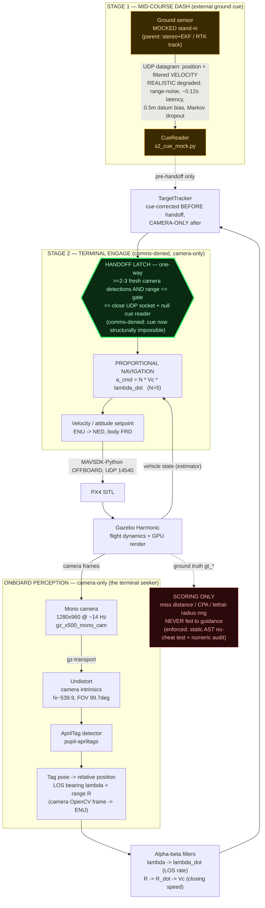

# DELIVERABLE A — ARCHITECTURE DIAGRAM

## A1. Mermaid (paste into any Mermaid renderer / GitHub README)



Legend: amber = mocked ground-sensor stand-in; green thick hexagon = the one-way HANDOFF (the headline beat); dashed red = the honesty boundary (ground truth is scoring-only, never fed to guidance).

## A2. ASCII fallback (drops into a plain-text README / terminal)

```
                    STAGE 1: MID-COURSE DASH (external ground cue)
   +-----------------------------------------------------------------------+
   |  Ground sensor  --UDP: position + filtered VELOCITY-->  CueReader      |
   |  (MOCKED stand-in;      REALISTIC degraded cue:         s2_cue_mock.py |
   |   parent = stereo+EKF   noise / ~0.12s latency /              |        |
   |   or RTK track)         0.5m datum bias / dropout            (pre-     |
   +---------------------------------------------------------------|handoff)+
                                                                    :  only
   ONBOARD PERCEPTION  (camera-only -- the terminal seeker)         :
   +----------------------------------------------------------+     :
   | Mono camera  --gz-transport-->  Undistort  -->  AprilTag |     :
   | 1280x960 @14Hz                  (fx~539.9,      detector |     :
   | gz_x500_mono_cam                 FOV 99.7deg)   (pupil-  |     :
   |                                                 apriltags)|    :
   |            --> Tag pose -> rel. position: LOS bearing     |    :
   |                lambda + range R  (OpenCV cam frame->ENU)  |    :
   +-------------------------------|--------------------------+     :
                                   v                                :
                      ALPHA-BETA FILTERS                            :
                   lambda -> lambda_dot (LOS rate)                  :
                   R -> R_dot -> Vc (closing speed)                 :
                                   |                                :
                                   v                                v
                          +----------------------------------------------+
                          |  TargetTracker: cue-corrected BEFORE handoff,|
                          |                 CAMERA-ONLY after            |
                          +----------------------|-----------------------+
                                                 v
              ####################################################
              #   >>> HANDOFF LATCH  (ONE-WAY, comms-denied) <<<  #
              #   >=2-3 fresh camera detections AND range<=gate    #
              #   => close UDP socket + null cue reader            #
              #   (external cue now STRUCTURALLY impossible)       #
              ####################################################
                                                 |
                    STAGE 2: TERMINAL ENGAGE (camera-only)
                                                 v
                       PROPORTIONAL NAVIGATION
                       a_cmd = N * Vc * lambda_dot   (N = 5)
                                                 |
                                                 v
                       Velocity/attitude setpoint  (ENU->NED, body FRD)
                                                 |
                            MAVSDK-Python OFFBOARD (UDP 14540)
                                                 v
       +-------------------+   camera frames    +----------------------------+
       |     PX4 SITL      |<-------------------|      Gazebo Harmonic        |
       |                   |--vehicle state---->|  (flight dynamics + render) |
       +-------------------+                    +--------------|--------------+
                                                               : ground truth (gt_*)
                                                               v
        ===========================================================
        ||  HONESTY BOUNDARY -- gt_* is SCORING ONLY:            ||
        ||  miss distance / CPA / lethal-radius ring.            ||
        ||  NEVER fed to guidance.                               ||
        ||  Enforced: static AST no-cheat test + numeric audit.  ||
        ===========================================================
```

Frame conventions (label on the diagram slide): World = ENU (origin at interceptor start); Camera = OpenCV (z fwd, x right, y down); Body = FRD. Phases in code: `TAKEOFF -> CUE_WAIT -> DASH -> [HANDOFF latch] -> ENGAGE -> BREAKOFF`. Note "HANDOFF" is a latch event, **not** a phase value — the HUD synthesizes it from `ext_fresh` going 1->0.

---

# DELIVERABLE B — DEMO-VIDEO SHOT LIST (refined to the real hero result)

**Hero flight = the ADR-0030 running-start + dash-track-fix intercept:** 9 m/s crossing target, pro-nav terminal (N=5), under the **REALISTIC degraded cue**, miss **~1.19 m**, handoff **6/6**. Delivered ZEM@handoff **3.2 -> 1.4 m**. It is the honest best because it beats the old *idealized*-cue running-start (1.90 m) while flying the harder degraded cue.

**Hero re-fly recipe (the frozen config to shoot):** `m4_intercept.py --fpv --handoff --law pronav --early-handoff` + running-start geometry `--y0-mag 29.3 --dash-speed 16 --dash-unclamp` + dash-track fix `--emit-velocity --cue-velocity` + realistic cue `--sigma-range --datum-bias-m 0.5 --latency-jitter-s 0.05 --dropout-markov`.

**Two hard readiness facts up front:**
- **ffmpeg is NOT installed** (confirmed: `which ffmpeg` -> none). Every step that stitches HUD frames into video, composites the HUD beside the Gazebo capture, or exports the MP4/GIF is **blocked on `sudo apt install -y ffmpeg`** (Emerson's sudo). `compose_demo.sh` and `demo_run.sh` are also **not built yet**.
- **`scripts/render_hud.py` works right now** and produces the entire HUD panel (640x1080 RGBA frames) from any per-tick CSV — validated tool. But existing hero-class CSVs have **`t_sim` unpopulated**, so `--fps` falls back to wall-clock time with a printed warning (fine for a draft; re-fly with the `t_sim` column added for clean HUD<->video time-sync). Per `demo_plan.md`'s hard gating rule, the **published** hero take must be a *fresh GUI flight* of the frozen recipe above — existing dev CSVs are for tooling drafts only.

HUD command per beat (same for all): `.venv/bin/python scripts/render_hud.py <hero_flight.csv> --out frames/ --fps 30 --radius 1.5` (net lethal radius; use `--radius 0.5` for the ram variant).

---

### BEAT 1 — Title / context card
- **Main render:** static title card. One line: *"Camera-only proportional-navigation counter-UAS intercept — PX4/Gazebo SITL."* Subtitle: the two-stage cue->handoff->camera-only architecture in one phrase.
- **HUD panel:** none (or the glass-cockpit frame pre-roll, dark).
- **Honest label:** none needed yet.
- **Readiness:** READY NOW (static graphic). Encoding into the reel needs ffmpeg.

### BEAT 2 — Far FPV approach
- **Main render:** wide 3rd-person Gazebo follow-cam; AprilTag target inbound at FPV speed across frame, interceptor on the ground / holding at standoff (~30 m). Sells "fast small drone, long way off."
- **HUD panel:** `PHASE: CUE_WAIT` (amber). SENSOR lamp: **EXTERNAL CUE (mocked)** (amber). RANGE / LOS RATE render as dim `--` (no camera track yet — NaN-safe, the honesty rule). Mini-map shows target GT track (dashed, dim) entering.
- **Honest label:** *"External cue = mocked ground-sensor stand-in, not live hardware"* (already burned into every HUD frame).
- **Readiness:** needs GUI capture (`sim_gui.sh` exists; screen/VideoRecorder capture step not scripted). HUD side READY NOW.

### BEAT 3 — Launch + external-cue DASH
- **Main render:** interceptor commits and accelerates on the running-start dash (dash flies ~16 m/s with `--dash-unclamp`); closing fast on the cue.
- **HUD panel:** `PHASE: DASH` (amber). SENSOR: **EXTERNAL CUE (mocked)** (amber). INTERCEPT SOLUTION: `SOLVING -> CONVERGED` as `tgt_*_hat` firms up. CLOSING SPEED climbs; RANGE collapses; on the mini-map the amber tracker estimate converges toward the dashed GT track.
- **Honest label:** speed-ramp disclosure — *"playback Nx real time; engagement is ~4 s of sim"* (the whole terminal is short; disclose the ramp).
- **Readiness:** needs GUI capture. HUD READY NOW.

### BEAT 4 — THE HANDOFF (headline beat, comms-denied)
- **Main render:** hold/slow-mo on the instant. Optionally a visual "external link severed" motif.
- **HUD panel:** the money shot — SENSOR lamp **flips EXTERNAL CUE (amber) -> CAMERA-ONLY (green)** on the tick `ext_fresh` goes 1->0; the `ext_*` readouts blank on-screen. `PHASE: DASH -> ENGAGE`. This is the one-way latch: the UDP socket is closed and the cue reader nulled, so the flip is structurally irreversible (that's *why* the HUD can treat it as a latch).
- **Honest label:** *"Handoff = one-way latch; cue channel closed. From here the intercept is camera-only (the comms-denied capability)."*
- **Readiness:** HUD READY NOW (the lamp logic is built and keyed off `ext_fresh`). Main render needs GUI capture. This beat is the single most important frame in the reel.

### BEAT 5 — Camera-only terminal pro-nav
- **Main render:** cut to / picture-in-picture the **onboard mono camera** feed with the AprilTag detection; tag centered as pro-nav nulls the line-of-sight rate. Range visibly collapsing.
- **HUD panel:** `PHASE: ENGAGE` (green). SENSOR: **CAMERA-ONLY** (green). LAW: **PRONAV**. The live pro-nav signal front-and-center: LOS RATE `lambda_dot` needle working toward zero, CLOSING SPEED high, RANGE dropping. Mini-map: green own-ship trail curving onto the amber camera-only track.
- **Honest label:** *"Terminal guidance uses the onboard camera only — no ground truth, no external cue."*
- **Readiness:** onboard-camera capture is a gz image-topic grab (doable headless as PNGs if VideoRecorder drops frames under WSLg). HUD READY NOW.

### (OPTIONAL) BEAT 5b — Maneuvering-target adaptation — FULL-VISION CUT ONLY
- **Status:** **NOT ready** — needs the **S3 maneuvering mover** (sim-time velocity schedule in `m4_target_mover.py`), not yet built. Do **not** stage a jink from straight-line data. Omit from the SHIP-NOW cut; add later.

### BEAT 6 — Intercept + honest lethal-radius kill graphic
- **Main render:** closest approach; interceptor and tag converge. No fake explosion.
- **HUD panel:** at CPA the mini-map draws the **lethal-radius ring** (dotted red, default net **R=1.5 m**; ram variant 0.5 m via `--radius`) + the red **CPA "x" marker** + the miss readout. The ring/marker never appear before the tick they actually occur (no foreknowledge — built-in). This is driven by `gt_range`, the *legitimate* scoring use of ground truth.
- **Honest label (burned in by render_hud):** *"CPA <miss> m (R_lethal criterion, NOT a modeled collision)"* + the standing *"GT markers = scoring reference only, never fed to guidance."*
- **Readiness:** kill graphic **READY NOW** (part of render_hud's mini-map). Compositing beside the flight video needs ffmpeg.

### BEAT 7 — Metrics outro card (the real numbers, honestly tiered)
- **Main render:** clean stat card. Structure it so the **gated/verifier-confirmed** claims headline and the **hero dev-number** is presented as current-best-with-caveat (this tiering *is* the credibility signal for a defense audience):
  - **Gated classics (rock-solid):** M4 pro-nav vs pursuit **4.6–7.6x tighter** (0.28–0.44 m vs 2.0–2.5 m, 2 m/s); M3 static standoff error **0.018 / 0.035 m**; S2 two-stage camera-only handoff validated + verifier-confirmed.
  - **The systems finding:** the fast-target miss is **kinematic, ~96% locked at handoff** (r²=0.957) — diagnosed, then recovered.
  - **Hero (current best, label as directional):** running-start + dash-track fix, **9 m/s ~1.19 m** (12 m/s ~1.48 m), **6/6 handoff**, under a **realistic degraded cue** — ADR-0030. Caveat on-card: *"dev A/B, n=6/speed, per-speed not yet individually significant; realistic-cue but clean AprilTag seeker — an upper bound on clean perception."*
- **Honest label:** *"Every number traces to a logged run. AprilTag = stand-in for a reliable target lock; the real seeker is unbuilt. Kill = lethal-radius criterion."*
- **Readiness:** READY NOW to author (all numbers exist in ADRs/logs). If you want the outro to cite a *gated* fast number, the ADR-0030 hero should first be re-flown as a small verifier-gated batch — right now it's a dev A/B, not a gate.

---

### Cut plan
- **SHIP-NOW cut:** beats 1-5, 6, 7 — needs only (a) ffmpeg installed and (b) one GUI capture of the frozen hero recipe. Everything HUD-side is already built and tested.
- **FULL-VISION cut:** add beat 5b once the S3 mover exists.

### Readiness summary (what blocks what)
| Capability | State | Blocker |
|---|---|---|
| HUD panel (all widgets, lamp, kill ring, CPA, honest footnotes) | **READY NOW** | none — `render_hud.py` validated |
| Hero per-tick data | exists as dev A/B CSVs | re-fly frozen recipe for the *published* take; add `t_sim` col for clean sync |
| Gazebo GUI flight capture | tooling partial | `sim_gui.sh` exists; `demo_run.sh` capture script **not built** |
| Onboard-camera feed capture | doable | gz image-topic -> PNGs (headless fallback if VideoRecorder drops frames) |
| Stitch / composite / MP4 / GIF | **BLOCKED** | **ffmpeg not installed** (`sudo apt install -y ffmpeg` — Emerson's sudo); `compose_demo.sh` not built |
| Maneuvering beat (5b) | **NOT READY** | S3 mover not built |

**Files referenced (all absolute):** `/home/emerson/interceptor-sim/scripts/render_hud.py`, `/home/emerson/interceptor-sim/scripts/m4_intercept.py`, `/home/emerson/interceptor-sim/scripts/s2_cue_mock.py`, `/home/emerson/interceptor-sim/scripts/sim_gui.sh`, `/home/emerson/interceptor-sim/docs/demo_plan.md`, `/home/emerson/interceptor-sim/docs/decisions.md` (ADR-0010/0013/0023/0027/0028/0029/0030). A sub-meter two-stage draft CSV to exercise the HUD today: `/home/emerson/interceptor-sim/logs/m4_intercept_pronav_20260706T182646Z.csv` (ENGAGE + handoff, miss 0.51 m) — a *draft/tooling* input only, not the published 9 m/s hero.
